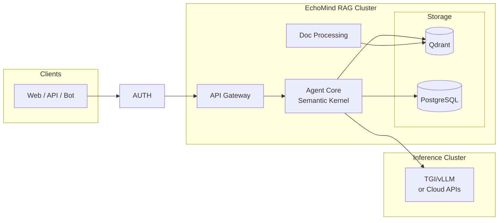

<div align="center">

# EchoMind

### Your Organization's AI Adoption Starts Now. For Free.

[](https://www.python.org/)
[](license)
[](#deployment-modes)

**From single container to cluster. From single user to entire organization.**<br/>
**One platform. Zero cost. Infinite possibilities.**

[Documentation](docs/architecture.md) · [Why EchoMind?](#why-echomind)

</div>

---

## 🧠 What is it?

EchoMind is an **agentic RAG platform** that actually *thinks* before it retrieves.

```
🔄 Think → Act → Observe → Reflect → Evaluate → Answer
```

> The agent 🤔 **thinks** about what information it needs, 🎯 **acts** by querying sources and tools, 🔍 **observes** the results, and 🤖 **reflects** on whether it has enough context. Before responding, it ⚖️ **evaluates** the quality and completeness of its answer — looping back if needed — then delivers a grounded 💬 **answer**.

|                                   |                                                                             |
|-----------------------------------|-----------------------------------------------------------------------------|
| 🔍 **Multi-Step Retrieval**       | Goes beyond "retrieve-then-generate" — reasons across multiple sources      |
| 🏠 **Private and SaaS LLM Ready** | Run with TGI/vLLM on your own GPU cluster or connected to your favorite LLM API |
| 🔒 **Air-Gap / SCIF Ready**       | No internet, no telemetry, no phone-home — fully self-contained             |
| 📦 **Deploy Anywhere**            | Single container to Kubernetes cluster — your choice                        |
| ⚖️ **MIT Licensed**               | Free and open source, forever                                               |


## Why EchoMind?

<table>
<tr>
<td width="33%" align="center">

### 🆓 Free Forever

**MIT Licensed. No strings attached.**

From a single user to a Fortune 500 enterprise—EchoMind is 100% free. No usage limits. No premium tiers. No vendor lock-in.

</td>
<td width="33%" align="center">

### 🚀 Deploy Your Way

**One container. Or a thousand nodes.**

Start with a single container. Scale to a distributed Kubernetes cluster when you're ready. Same codebase, same config.

</td>
<td width="33%" align="center">

### ⚡ AI in Seconds

**Your org's AI journey starts today.**

Stop waiting for budget approvals and vendor negotiations. Deploy EchoMind now and give your team AI-powered knowledge retrieval before your next meeting.

</td>
</tr>
</table>

---

## What is EchoMind?

EchoMind is an **Agentic Retrieval-Augmented Generation (RAG)** platform that goes beyond traditional retrieve-then-generate patterns. Unlike conventional RAG systems that simply fetch and paste context, EchoMind's agent:

- **Reasons** about what information it needs before retrieving
- **Plans** multi-step retrieval strategies across multiple data sources
- **Uses tools** to execute actions, call APIs, and process data
- **Remembers** context across conversations with short-term and long-term memory

---
 
## Key Features

| Feature | Description |
|---------|-------------|
| **Agentic Architecture** | Think → Act → Observe → Reflect loop for intelligent retrieval |
| **Multi-Source Connectors** | Microsoft Teams, Google Drive (v1), with more planned |
| **Flexible Deployment** | Cloud, Hybrid, or fully Air-Gapped (SCIF compliant) |
| **Private LLM Inference** | TGI/vLLM for on-premise GPU clusters |
| **Enterprise Auth** | Authentik with OIDC/LDAP/Active Directory support |
| **Per-User Vector Collections** | Scoped search across user, group, and organization data |

---

## Architecture Overview



For detailed architecture, see [docs/architecture.md](docs/architecture.md).

---

## Deployment Modes

EchoMind adapts to your security requirements:

| Mode | Description                                              | Use Case |
|------|----------------------------------------------------------|----------|
| **Cloud** | Deploy on your Could | Startups, teams without GPU infrastructure |
| **Hybrid** | Private RAG cluster + optional cloud LLM fallback        | Enterprises with sensitive data |
| **Air-Gapped** | Fully disconnected, zero external dependencies           | DoD, SCIF, classified networks |

### Air-Gapped / SCIF Compliance

EchoMind is designed for the most restricted environments:

- No internet access required
- No telemetry or phone-home capabilities
- All dependencies pre-packaged in container images
- Deployable to [Iron Bank (Platform One)](https://p1.dso.mil/iron-bank)
- LDAP/Active Directory integration via Authentik

---

## Tech Stack

| Component | Technology | Notes |
|-----------|------------|-------|
| Agent Framework | [Semantic Kernel](https://github.com/microsoft/semantic-kernel) | Microsoft's AI orchestration SDK |
| Vector Database | [Qdrant](https://qdrant.tech/) | High-performance, Rust-based |
| LLM Inference | TGI / vLLM | Private GPU cluster support |
| Auth | [Authentik](https://goauthentik.io/) | Self-hosted OIDC provider |
| API | FastAPI + WebSocket | Async, streaming responses |
| Message Queue | NATS JetStream | Lightweight, persistent |
| Metadata DB | PostgreSQL | Reliable, JSONB support |
| Object Storage | MinIO / RustFS | S3-compatible (evaluating RustFS) |

---

## Project Structure

```
echomind/
├── docs/                    # Documentation
│   └── architecture.md      # Technical architecture
├── src/
│   ├── api/                 # FastAPI application
│   ├── agent/               # Semantic Kernel agent core
│   ├── services/            # Background workers
│   ├── connectors/          # Data source connectors
│   ├── db/                  # Database clients
│   └── proto/               # Protocol Buffer definitions
│       ├── public/          # API objects (client-facing)
│       └── internal/        # Internal service objects
├── deployment/
│   ├── docker/              # Docker Compose files
│   └── k8s/                 # Kubernetes manifests
├── config/                  # Configuration files
└── tests/
```

> **Schema-First Development**: Proto definitions in `src/proto/` are the source of truth. CI generates TypeScript types (for clients) and Pydantic models (for Python) automatically.

---

## Contributing

We're building EchoMind in Python and welcome contributions in:

- **Backend**: FastAPI, async Python, gRPC
- **AI/ML**: Semantic Kernel, embeddings, reranking
- **Infrastructure**: Kubernetes, Docker, CI/CD
- **Connectors**: Microsoft Graph API, Google APIs

---

## Documentation

- [Architecture](docs/architecture.md) - Technical design with Mermaid diagrams
- API Documentation - *Coming soon*

---

## License

MIT License - See [LICENSE](license) for details.
