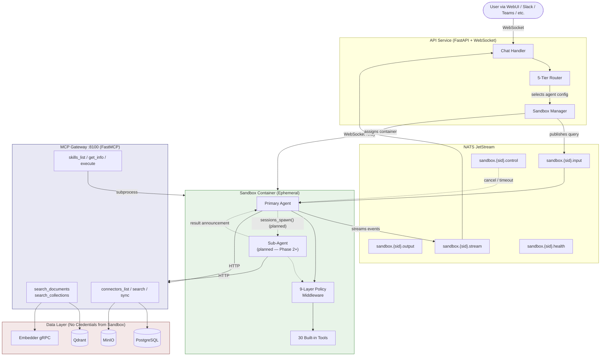
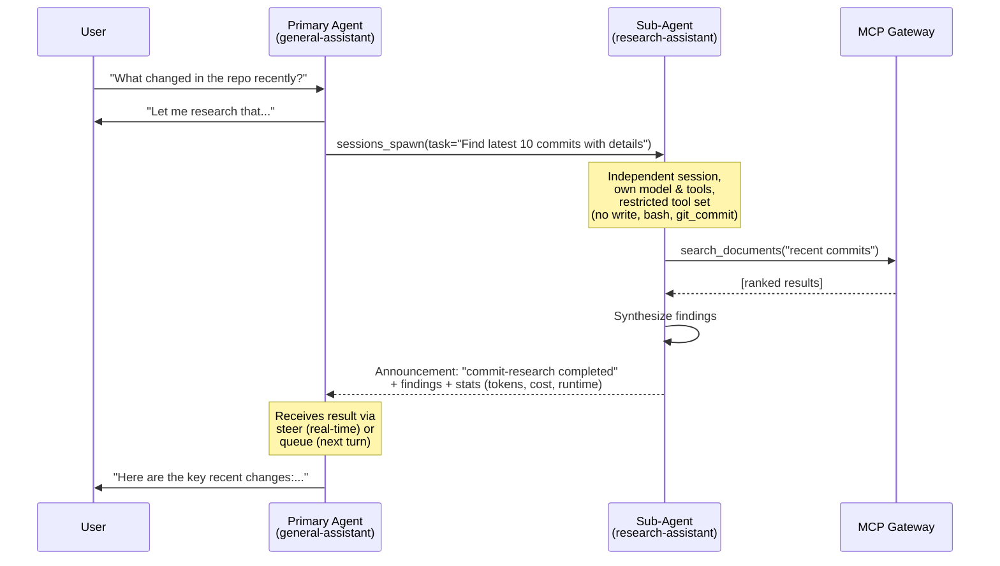
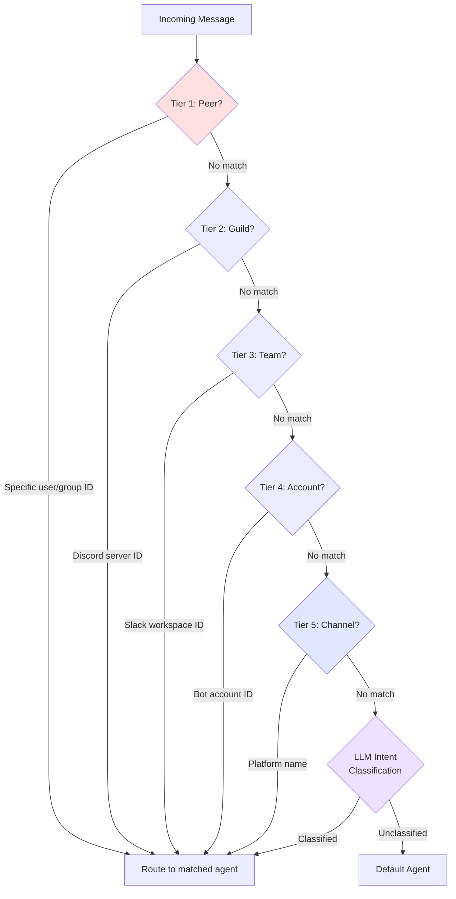
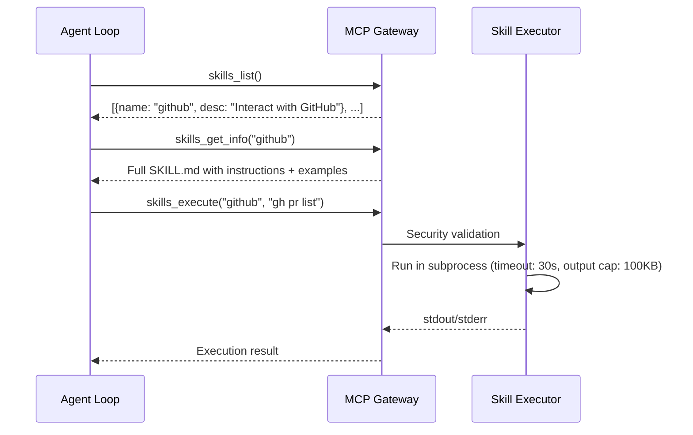
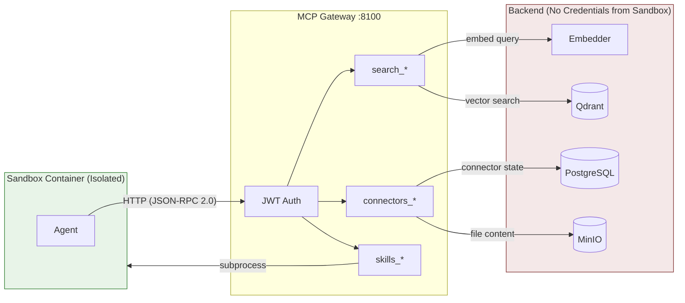

# EchoMind Agent Architecture

> A technical overview for software engineers — no AI background required.

---

## What Is an AI Agent?

A traditional API call is **stateless**: you send a request, get a response, done. An AI agent is different — it's a **loop**. The agent receives a task, *reasons* about what to do, *acts* by calling tools (functions), *observes* the result, and repeats until the task is complete. Think of it as an autonomous worker with access to a toolbox.

EchoMind's agent system is a **multi-agent architecture**: multiple agents with different personalities, tools, and models can serve different users and channels. The system is designed so a primary agent can **spawn sub-agents** for specialized tasks and agents can **communicate with each other** — all governed by a strict 9-layer policy system.

> **Implementation status:** The 9-layer policy engine, 5-tier routing, 30 built-in tools, MCP integration, and session management are **built and tested** (Phase 1, 152 tests passing). Sub-agent spawning (`sessions_spawn`), agent-to-agent communication, and sandbox containers are **designed but not yet implemented** (Phases 2-5). This document describes the full target architecture.

---

## High-Level Architecture



### How a Request Flows

1. **User sends a message** via WebSocket with `mode=agent`
2. **The API's 5-Tier Router** selects which agent configuration handles the request (based on user, channel, team bindings)
3. **Sandbox Manager** assigns an ephemeral container from the warm pool (~50ms) and publishes the query to NATS
4. **Inside the sandbox**, the selected agent config is loaded — its system prompt, model, and tool policy are unique to that agent
5. **The Agent Loop** runs: the LLM reasons, calls tools, observes results, and streams response events back via NATS
6. **The 9-Layer Policy** filters which tools the agent sees *before every LLM call*
7. **For data access**, the agent calls the MCP Gateway over HTTP — it never touches databases directly
8. **(Planned)** If the task is complex, the primary agent will be able to **spawn a sub-agent** with a different model/tools to handle a subtask, then incorporate its result

---

## Multi-Agent System

EchoMind is not a single-agent system. The YAML config defines **multiple agent personalities**, each with its own system prompt, LLM model, and tool access:

```yaml
agents:
  - id: research-assistant
    instructions: "You are a research assistant. Search documents and summarize findings."
    model: claude-sonnet-4-5-20250929
    tools: { profile: minimal }           # Read-only: search, read, grep

  - id: coding-assistant
    instructions: "You are a coding assistant. Help with code, debugging, and git."
    model: claude-opus-4-6
    tools: { profile: coding }            # Full dev: bash, write, edit, git

  - id: general-assistant
    instructions: "You are a helpful general assistant."
    model: gpt-4o
    tools: { profile: full }              # Everything
```

### Sub-Agent Spawning (Planned — Phase 2+)

The architecture is designed so a primary agent can **delegate subtasks** to child agents. The parent will call `sessions_spawn()`, which creates an independent agent with its own session, model, and tools. The sub-agent runs autonomously, and its result flows back to the parent via an **announcement system**. The policy infrastructure (Layer 9 subagent restrictions) is already built; the spawning mechanism itself is planned for Phase 2+.



**Key constraints:**
- Sub-agents **cannot spawn their own sub-agents** (prevents infinite nesting)
- Sub-agents get a **restricted tool set** — Layer 9 of the policy system removes tools listed in `sandbox.subagent_denied_tools` (configurable, defaults: `write`, `bash`, `git_add`, `git_commit`)
- Each sub-agent runs in its own **isolated session** with its own conversation history
- Results return via 3 paths: **steer** (inject into active parent), **queue** (parent picks up next turn), or **direct** (spawn a new parent turn)

### Agent-to-Agent Communication (Planned)

The design supports peer agents **messaging each other directly** (not just parent-child). This will be controlled by an agent-to-agent policy with configurable "ping-pong" turns:

```yaml
tools:
  agentToAgent:
    enabled: true
    maxPingPongTurns: 5
    allow:
      - "support:*"           # Support can message any agent
      - "coder:researcher"    # Coder can talk to researcher
```

---

## The 9-Layer Policy System

The policy engine is a **cascading filter** that narrows which tools an agent can use. Each layer can only *remove* tools, never re-add them. Deny always wins over allow. This runs as middleware *before every LLM call*, so the model only sees tools it's actually permitted to use.

```mermaid
graph LR
    All["All 30+ Tools"] --> L1
    L1["1. Profile<br/>(minimal/coding/full)"] --> L2
    L2["2. Provider Profile<br/>(per LLM vendor)"] --> L3
    L3["3. Global Policy<br/>(allow/deny patterns)"] --> L4
    L4["4. Global + Provider<br/>(vendor-specific global)"] --> L5
    L5["5. Agent Policy<br/>(per-agent allow/deny)"] --> L6
    L6["6. Agent + Provider<br/>(per-agent + vendor)"] --> L7
    L7["7. Group/Channel<br/>(planned — skipped)"] --> L8
    L8["8. Sandbox<br/>(denied_tools list)"] --> L9
    L9["9. Subagent<br/>(child agent limits)"] --> Final["~10-25 Tools<br/>Available to LLM"]

    style All fill:#ff9999
    style Final fill:#99ff99
```



| Layer | What It Filters | Example |
|-------|----------------|---------|
| **1. Profile** | Named presets defining a base toolset | `minimal` = read-only (12 tools); `coding` = dev tools (18 patterns incl. `git_*`); `messaging` = no tools; `full` = everything |
| **2. Provider Profile** | Per-LLM-vendor profile override | Anthropic models get a different baseline than OpenAI models |
| **3. Global Policy** | Org-wide allow/deny with wildcard patterns | `deny: ["git_*"]` blocks all git tools globally |
| **4. Global + Provider** | Vendor-specific global overrides | Allow `bash` for OpenAI but deny it for local models |
| **5. Agent Policy** | Per-agent allow/deny rules | A "research" agent only gets `read`, `grep`, `search_*` |
| **6. Agent + Provider** | Per-agent + vendor combination | Agent X on Claude gets different tools than Agent X on GPT |
| **7. Group/Channel** | Per-channel restrictions *(not yet implemented — skipped)* | Future: Slack agents can't use `delete` |
| **8. Sandbox** | Tools blocked inside sandbox containers | Remove dangerous tools in sandboxed execution |
| **9. Subagent** | Tools blocked for child agents spawned by a parent | Configurable deny list; defaults: `write`, `bash`, `git_add`, `git_commit` |

**Security invariant:** An agent acting on behalf of a user can never have *more* tool access than the user's role permits. Each layer only narrows; nothing re-expands.

**Implementation:** [`src/agent/policy/engine.py`](../../src/agent/policy/engine.py) — `ToolPolicyEngine` applies all 9 layers. [`src/agent/policy/middleware.py`](../../src/agent/policy/middleware.py) — `ToolPolicyMiddleware` intercepts the tool list before each LLM call.

---

## The 5-Tier Routing System

Routing determines **which agent configuration** handles an incoming message. Like CSS specificity, the most specific match wins. This enables different agents for different users, channels, and platforms.



| Tier | Matches On | Example |
|------|-----------|---------|
| **1. Peer** (highest) | Specific user or group ID | "User alice always gets the VIP agent" |
| **2. Guild** | Server/workspace ID | "All users in Discord server #dev get the coding agent" |
| **3. Team** | Team/workspace ID | "Slack workspace Engineering gets the tech agent" |
| **4. Account** | Bot account ID | "Messages via bot-secondary get the backup agent" |
| **5. Channel** (lowest) | Platform name | "All Telegram messages get the telegram agent" |
| **Intent** (fallback) | LLM classifies user intent | When no binding matches, an LLM picks the best agent |
| **Default** | Config default | Catch-all: `routing.defaults.agentId` |

Each matched agent gets its own **session key** (e.g., `agent:support:discord:channel:111222333`), ensuring conversation history stays isolated per agent-channel-user combination.

**Implementation:** [`src/agent/routing/router.py`](../../src/agent/routing/router.py) — `AgentRouter`. [`src/agent/routing/intent.py`](../../src/agent/routing/intent.py) — `IntentClassifier` (LLM fallback).

---

## How Skills Work

Skills are **pre-packaged capabilities** defined as markdown files (SKILL.md) with YAML metadata. They follow a **progressive disclosure** pattern — the agent discovers skills incrementally to keep the LLM context small.



| Step | Tool | Purpose |
|------|------|---------|
| 1. Browse | `skills_list()` | Lightweight: name + one-line description for all skills |
| 2. Learn | `skills_get_info(name)` | Full instructions, examples, parameter docs |
| 3. Execute | `skills_execute(name, cmd)` | Run the command with timeout and output limits |

**Security:** Skills run inside the sandboxed container with strict resource limits (2 CPU, 2GB RAM, 100MB tmpfs). Command validation with dangerous pattern blocking (e.g., `rm -rf /`, `curl | sh`, `chmod 777`) is planned for the `CommandAnalyzer` component in the MCP Gateway.

**Target inventory:** 42 skills planned — 27 direct ports, 8 adapted, 3 replaced with EchoMind-native equivalents, and 4 new EchoMind-only skills. Covers development (git, GitHub), web (curl, jq), media (ffmpeg), system administration, and more.

---

## How Data Connections Work

The agent accesses EchoMind's data exclusively through the **MCP Gateway** — a dedicated service that mediates all data access. The agent never sees database credentials or direct connections.



**Data isolation** enforced at the application layer. Sandbox containers share the backend Docker network (required for NATS access) but have no credentials for PostgreSQL, Qdrant, MinIO, or the Embedder. All data access is mediated through the MCP Gateway. Network-level iptables isolation is planned for future hardening.

**What is MCP?** The [Model Context Protocol](https://modelcontextprotocol.io/) (created by Anthropic, Nov 2024) is an open standard for connecting AI applications to external tools and data — like USB-C for AI. Any MCP-compatible agent can use any MCP-compatible tool server. The MCP Gateway exposes EchoMind's data as standardized tools over JSON-RPC 2.0. [[Spec](https://modelcontextprotocol.io/specification/2025-11-25)]

**MCP Gateway tool namespaces:**

| Namespace | Tools | Backend | Phase |
|-----------|-------|---------|-------|
| `search` | `search_documents`, `search_collections`, `get_document`, `get_document_chunks` | Qdrant + Embedder | 1 |
| `skills` | `skills_list`, `skills_get_info`, `skills_execute` | Filesystem + subprocess | 1 |
| `connectors` | `connectors_list`, `connector_status`, `connector_sync` | PostgreSQL + MinIO + NATS | 2 |
| `api` | `web_search`, `send_email`, `calendar_*` | External APIs (Google, MSFT) | 2 |

**Connectors** (Google Drive, OneDrive, Gmail, etc.) are data sources that sync documents into Qdrant. The agent interacts with them through MCP — it can list connectors, check sync status, search connector-specific documents, or trigger a manual sync. The agent never sees OAuth tokens; the MCP Gateway handles token refresh internally.

**What is a Sandbox?** An ephemeral Docker container where the agent executes tools in isolation. Key properties:
- **Warm pool** of 3 pre-created containers (~50ms assignment vs ~2s cold start)
- **Lifecycle:** `WARM → ASSIGNED → ACTIVE → DRAINING → DESTROYED`
- **Security:** non-root user, read-only root FS, all Linux capabilities dropped, 2 CPU / 2GB RAM / 100 PIDs max, tmpfs /tmp (100MB)
- **Communication:** 5 NATS JetStream subjects per session: `.input` (API → Sandbox), `.output` (final responses), `.stream` (token-level streaming), `.control` (cancel/timeout), `.health` (15s heartbeat)

---

## Technology Stack

| Component | Technology | Role |
|-----------|-----------|------|
| Agent Framework | [Microsoft Agent Framework](https://learn.microsoft.com/en-us/semantic-kernel/frameworks/agent/agent-architecture) (AutoGen + Semantic Kernel) | Agent loop, tool calling, middleware |
| MCP Gateway | [FastMCP](https://modelcontextprotocol.io/) on Streamable HTTP | Standardized tool interface for data access |
| Vector Search | [Qdrant](https://qdrant.tech/) | Semantic document search (embeddings) |
| Database | PostgreSQL | Relational data (users, connectors, sessions) |
| Object Store | MinIO (S3-compatible) | Document file storage |
| Message Queue | [NATS JetStream](https://nats.io/) | Async communication (API ↔ Sandbox) |
| LLM Providers | OpenAI, Anthropic (Claude), local (Ollama) | Language model inference |
| Sandbox | Ephemeral Docker containers | Isolated agent execution |

---

## Glossary

| Term | Plain-English Definition |
|------|------------------------|
| **LLM** | Large Language Model — the AI that generates text (e.g., GPT-4, Claude) |
| **Tool / Function Calling** | The LLM requests to run a specific function (e.g., "search documents"). The framework executes it and returns the result to the LLM. |
| **Agent Loop** | Think → Act → Observe → Repeat. The agent keeps calling tools until it has enough information to respond. |
| **Sub-Agent** | A child agent spawned by a parent to handle a specific subtask independently, with its own session, model, and restricted tools. |
| **Vector Search** | Finding documents by *meaning* rather than keywords. Text is converted to numbers (embeddings); similar meanings produce similar numbers. |
| **MCP** | Model Context Protocol — a standard interface for AI tools, like USB-C for peripherals. [[Spec](https://modelcontextprotocol.io/specification/2025-11-25)] |
| **Middleware** | Code that runs *between* the request and the handler. Policy middleware filters tools before the LLM sees them. |
| **Sandbox** | An isolated container where agent code runs safely, with strict resource and network limits. |
| **Binding** | A routing rule that maps a match condition (user, channel, team) to a specific agent configuration. |
| **Session Key** | A deterministic string (e.g., `agent:support:discord:channel:123`) that isolates conversation history per agent-channel-user combination. |

---

## References

**Official Documentation:**
- [Microsoft Agent Framework](https://learn.microsoft.com/en-us/semantic-kernel/frameworks/agent/agent-architecture) — Agent loop, orchestration patterns
- [Model Context Protocol Specification](https://modelcontextprotocol.io/specification/2025-11-25) — MCP standard
- [Azure AI Agent Design Patterns](https://learn.microsoft.com/en-us/azure/architecture/ai-ml/guide/ai-agent-design-patterns) — Multi-agent orchestration
- [Semantic Kernel Plugins](https://learn.microsoft.com/en-us/semantic-kernel/concepts/plugins/) — Function calling, tool registration

**Source Code:**
- [`src/agent/policy/engine.py`](../../src/agent/policy/engine.py) — 9-Layer Policy Engine
- [`src/agent/routing/router.py`](../../src/agent/routing/router.py) — 5-Tier Router
- [`src/agent/tools/registry.py`](../../src/agent/tools/registry.py) — Tool Registry (30 tools)
- [`src/agent/mcp/manager.py`](../../src/agent/mcp/manager.py) — MCP Server Lifecycle
- [`src/agent/config/schema.py`](../../src/agent/config/schema.py) — YAML Configuration Schema
