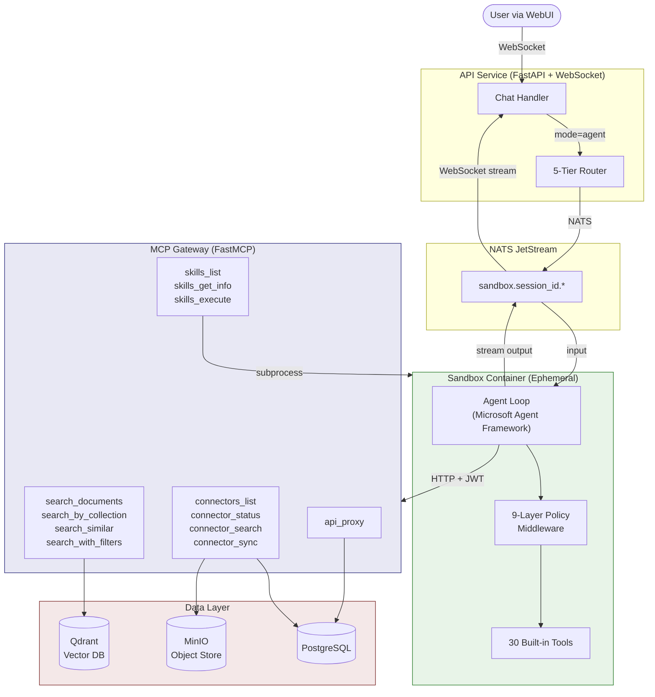
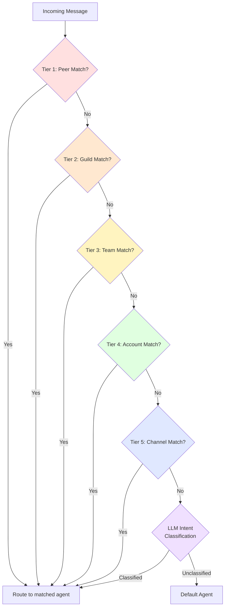
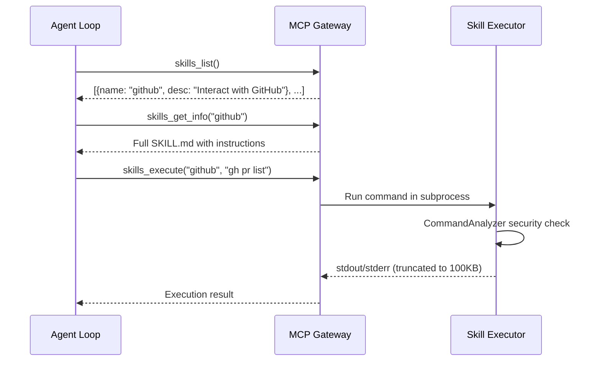
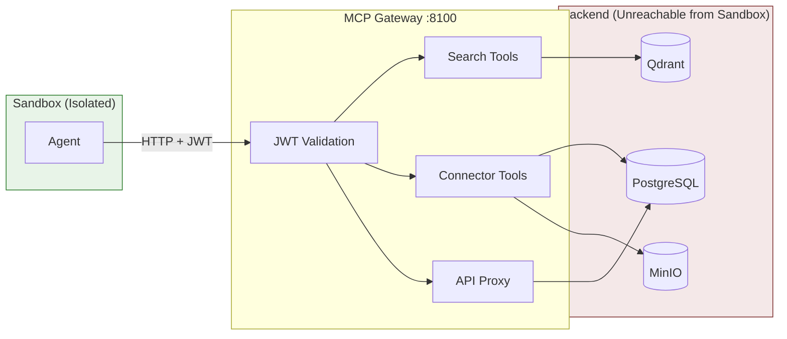

# EchoMind Agent Architecture

> A technical overview for software engineers — no AI background required.

---

## What Is an AI Agent?

A traditional API call is **stateless**: you send a request, get a response, done. An AI agent is different — it's a **loop**. The agent receives a task, *reasons* about what to do, *acts* by calling tools (functions), *observes* the result, and repeats until the task is complete. Think of it as an autonomous worker with access to a toolbox.

EchoMind's agent system lets users interact with an AI that can search documents, query databases, run code, sync external data sources, and more — all governed by a strict policy and routing layer.

---

## High-Level Architecture



**How a request flows:**

1. User sends a message via WebSocket with `mode=agent`
2. The **5-Tier Router** selects which agent handles the request
3. The message is relayed to an **ephemeral sandbox container** via NATS
4. Inside the sandbox, the **Agent Loop** reasons, calls tools, and streams results back
5. The **9-Layer Policy** filters which tools the agent can use on every LLM call
6. For data access (document search, connectors), the agent calls the **MCP Gateway** over HTTP — it never touches databases directly

---

## The 9-Layer Policy System

The policy engine is a **cascading filter** that narrows which tools an agent can use. Each layer can only *remove* tools, never re-add them. Deny always wins over allow. This runs as middleware *before every LLM call*, so the model only sees tools it's actually permitted to use.

```mermaid
graph LR
    All["All 30 Tools"] --> L1
    L1["1. Profile<br/>(minimal/coding/full)"] --> L2
    L2["2. Provider Profile<br/>(per LLM vendor)"] --> L3
    L3["3. Global Policy<br/>(allow/deny patterns)"] --> L4
    L4["4. Global + Provider<br/>(vendor-specific global)"] --> L5
    L5["5. Agent Policy<br/>(per-agent allow/deny)"] --> L6
    L6["6. Agent + Provider<br/>(per-agent + vendor)"] --> L7
    L7["7. Group/Channel<br/>(future)"] --> L8
    L8["8. Sandbox<br/>(denied_tools list)"] --> L9
    L9["9. Subagent<br/>(child agent limits)"] --> Final["~10-25 Tools<br/>Available to LLM"]

    style All fill:#ff9999
    style Final fill:#99ff99
```



| Layer | What It Filters | Example |
|-------|----------------|---------|
| **1. Profile** | Named presets defining a base toolset | `minimal` = read-only (12 tools); `coding` = dev tools (28 tools); `full` = everything |
| **2. Provider Profile** | Per-LLM-vendor profile override | Anthropic models get a different baseline than OpenAI models |
| **3. Global Policy** | Org-wide allow/deny with wildcard patterns | `deny: ["git_*"]` blocks all git tools globally |
| **4. Global + Provider** | Vendor-specific global overrides | Allow `bash` for OpenAI but deny it for local models |
| **5. Agent Policy** | Per-agent allow/deny rules | A "research" agent only gets `read`, `grep`, `search_*` |
| **6. Agent + Provider** | Per-agent + vendor combination | Agent X on Claude gets different tools than Agent X on GPT |
| **7. Group/Channel** | Per-channel restrictions (placeholder) | Future: Slack agents can't use `delete` |
| **8. Sandbox** | Tools blocked inside sandbox containers | Remove `git_push` in sandboxed execution |
| **9. Subagent** | Tools blocked for child agents spawned by a parent | Sub-agents can't `write`, `bash`, `git_commit` by default |

**Implementation:** `ToolPolicyEngine` in [`src/agent/policy/engine.py`](../../src/agent/policy/engine.py) applies all 9 layers sequentially. `ToolPolicyMiddleware` in [`src/agent/policy/middleware.py`](../../src/agent/policy/middleware.py) intercepts the tool list before each LLM call.

**Security invariant:** An agent acting on behalf of a user can never have *more* tool access than the user's role permits. Each layer only narrows; nothing re-expands.

---

## The 5-Tier Routing System

Routing determines **which agent** handles an incoming message. EchoMind uses a binding-based hierarchy — like CSS specificity, the most specific match wins.



| Tier | Priority | Matches On | Use Case |
|------|----------|-----------|----------|
| **1. Peer** | Highest | Specific user or group ID | "User X always talks to Agent Y" |
| **2. Guild** | High | Server/workspace ID (e.g., Discord server) | All users in Server Z use Agent W |
| **3. Team** | Medium | Team/workspace (e.g., Slack workspace) | Team-level agent assignment |
| **4. Account** | Low | Bot account ID | Route by which bot account received the message |
| **5. Channel** | Lowest | Platform name (e.g., "slack", "teams") | Platform-wide default agent |
| **Intent** | Fallback | LLM classifies user intent | When no binding matches, an LLM reads the message and picks the best agent |
| **Default** | Final | Config default | Catch-all when nothing else matches |

**How bindings are defined** (YAML config):
```yaml
routing:
  defaults:
    agentId: general-assistant
  bindings:
    - match:
        peer: { kind: user, id: "user-123" }
      agentId: vip-assistant        # Tier 1: specific user
    - match:
        channel: slack
      agentId: slack-assistant       # Tier 5: all Slack messages
```

**Implementation:** `AgentRouter` in [`src/agent/routing/router.py`](../../src/agent/routing/router.py) evaluates bindings. `IntentClassifier` in [`src/agent/routing/intent.py`](../../src/agent/routing/intent.py) handles the LLM fallback. `SessionKeyBuilder` in [`src/agent/routing/session.py`](../../src/agent/routing/session.py) generates deterministic session keys for conversation continuity.

---

## How Skills Work

Skills are **pre-packaged capabilities** defined as markdown files (SKILL.md) with YAML metadata. They follow a **progressive disclosure** pattern — the agent discovers skills incrementally, not all at once.



**Three MCP tools** expose skills to the agent:

| Tool | Purpose | Returns |
|------|---------|---------|
| `skills_list()` | Browse available skills | Name + one-line description for each |
| `skills_get_info(name)` | Read full instructions | Complete SKILL.md content |
| `skills_execute(name, cmd)` | Run a skill command | stdout/stderr with timeout enforcement |

**Security:** The `CommandAnalyzer` blocks dangerous patterns (e.g., `rm -rf /`, `curl | sh`, `chmod 777`) before any command executes. Skills run inside the sandboxed container with resource limits (2 CPU, 2GB RAM, 100MB tmpfs).

**Skill definition format:**
```yaml
---
name: github
description: "Interact with GitHub repositories"
command: "gh"
args: ["{{input}}"]
timeout: 30
max_output_bytes: 100000
---
# GitHub CLI Skill
Use `gh` to manage PRs, issues, and repos...
```

**Current inventory:** 42 skills covering development (git, GitHub), web (curl, jq), media (ffmpeg), system administration, and more.

---

## How Data Connections Work

The agent accesses EchoMind's data layer exclusively through the **MCP Gateway** — a dedicated service that mediates all data access. The agent never sees database credentials or direct connections.



**Key design principle:** Network isolation enforced by Docker networks and iptables rules. The sandbox container *can* reach the MCP Gateway and the internet, but *cannot* reach PostgreSQL, Qdrant, MinIO, Redis, or the Embedder.

**MCP Gateway tools** (12 total across 4 namespaces):

| Namespace | Tools | Data Source |
|-----------|-------|------------|
| `search` | `search_documents`, `search_by_collection`, `search_similar`, `search_with_filters` | Qdrant (vector search) |
| `connectors` | `connectors_list`, `connector_status`, `connector_search`, `connector_sync` | PostgreSQL + MinIO |
| `skills` | `skills_list`, `skills_get_info`, `skills_execute` | Local SKILL.md files |
| `api` | `api_proxy` | EchoMind REST API |

**What is MCP?** The [Model Context Protocol](https://modelcontextprotocol.io/) (created by Anthropic, Nov 2024) is an open standard for connecting AI applications to external tools and data — like USB for AI. The MCP Gateway exposes EchoMind's data as standardized tools that any MCP-compatible agent can use. [[MCP Spec](https://modelcontextprotocol.io/specification/2025-11-25)]

**What is a Sandbox?** An ephemeral Docker container where the agent executes code and tools in isolation. Sandboxes follow a lifecycle: `WARM → ASSIGNED → ACTIVE → DRAINING → DESTROYED`. A warm pool of 3 pre-created containers provides ~50ms assignment time. Each sandbox runs as a non-root user with dropped capabilities, read-only root filesystem, and strict resource limits (2 CPU, 2GB RAM, PID limit 100).

---

## Technology Stack

| Component | Technology | Role |
|-----------|-----------|------|
| Agent Framework | [Microsoft Agent Framework](https://learn.microsoft.com/en-us/semantic-kernel/frameworks/agent/agent-architecture) (AutoGen + Semantic Kernel) | Agent loop, tool calling, middleware |
| MCP Gateway | [FastMCP 3.x](https://modelcontextprotocol.io/) | Standardized tool interface for data access |
| Vector Search | [Qdrant](https://qdrant.tech/) | Semantic document search (embeddings) |
| Database | PostgreSQL | Relational data (users, connectors, sessions) |
| Object Store | MinIO | Document file storage |
| Message Queue | [NATS JetStream](https://nats.io/) | Async communication (API ↔ Sandbox) |
| LLM Providers | OpenAI, Anthropic (Claude), local (Ollama) | Language model inference |
| Sandbox | Docker containers | Isolated agent execution |

---

## Glossary

| Term | Plain-English Definition |
|------|------------------------|
| **LLM** | Large Language Model — the AI that generates text (e.g., GPT-4, Claude) |
| **Tool / Function Calling** | The LLM requests to run a specific function (e.g., "search documents for X"). The framework executes it and returns the result. |
| **Agent Loop** | Think → Act → Observe → Repeat. The agent keeps calling tools until it has enough information to respond. |
| **Vector Search** | Finding documents by *meaning* rather than keywords. Text is converted to numbers (embeddings); similar meanings have similar numbers. |
| **MCP** | Model Context Protocol — a standard interface for AI tools, like USB for peripherals. |
| **Middleware** | Code that runs *between* the request and the handler. Policy middleware filters tools before the LLM sees them. |
| **Sandbox** | An isolated container where untrusted code runs safely, with strict resource and network limits. |
| **Binding** | A routing rule that maps a match condition (user, channel, team) to a specific agent. |

---

## References

- [Microsoft Agent Framework Docs](https://learn.microsoft.com/en-us/semantic-kernel/frameworks/agent/agent-architecture)
- [Model Context Protocol Specification](https://modelcontextprotocol.io/specification/2025-11-25)
- [Azure AI Agent Design Patterns](https://learn.microsoft.com/en-us/azure/architecture/ai-ml/guide/ai-agent-design-patterns)
- [Semantic Kernel Plugins](https://learn.microsoft.com/en-us/semantic-kernel/concepts/plugins/)
- Source: [`src/agent/policy/engine.py`](../../src/agent/policy/engine.py) — 9-Layer Policy Engine
- Source: [`src/agent/routing/router.py`](../../src/agent/routing/router.py) — 5-Tier Router
- Source: [`src/agent/tools/registry.py`](../../src/agent/tools/registry.py) — Tool Registry (30 tools)
- Source: [`src/agent/mcp/manager.py`](../../src/agent/mcp/manager.py) — MCP Server Lifecycle
