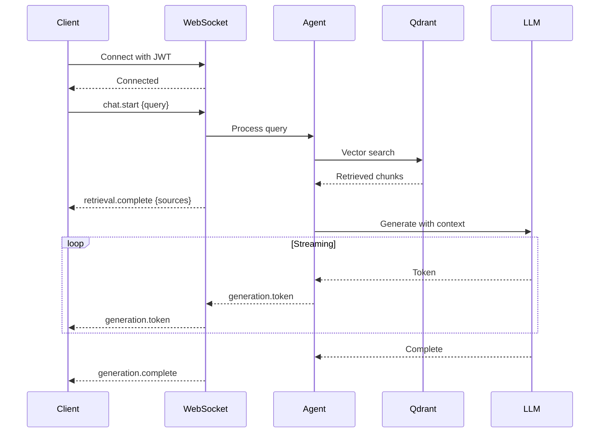

# EchoMind API Specification

> REST API + WebSocket streaming for the EchoMind Agentic RAG platform.

## Schema-First Development

All data models are defined in Protocol Buffers (`.proto` files) as the single source of truth:

```
src/proto/
├── public/          # Client-facing API objects
│   ├── user.proto
│   ├── connector.proto
│   ├── document.proto
│   ├── chat.proto
│   └── assistant.proto
└── internal/        # Internal service objects
    ├── embedding.proto
    └── agent.proto
```

**CI Pipeline generates:**
- **TypeScript types** → For web/mobile clients
- **Pydantic models** → For Python backend validation

This ensures type safety across the entire stack and eliminates model drift.

---

## Overview

EchoMind exposes two communication channels:

| Channel | Purpose | Protocol |
|---------|---------|----------|
| **REST API** | CRUD operations, configuration, management | HTTP/HTTPS |
| **WebSocket** | Real-time chat streaming, agent responses | WS/WSS |

**Base URL**: `https://{host}/api/v1`
**WebSocket URL**: `wss://{host}/ws/v1`

---

## Authentication

All requests require a valid JWT token obtained from Authentik (OIDC).

```http
Authorization: Bearer <jwt_token>
```

### Token Claims

```json
{
  "sub": "user-uuid",
  "email": "user@example.com",
  "name": "John Doe",
  "groups": ["engineering", "admins"],
  "roles": ["user", "admin"],
  "exp": 1234567890
}
```

---

## API Resources

### 1. Users

User management (synced from Authentik).

| Method | Endpoint | Description |
|--------|----------|-------------|
| `GET` | `/users/me` | Get current user profile |
| `PUT` | `/users/me` | Update current user preferences |
| `GET` | `/users` | List all users (admin only) |
| `GET` | `/users/{id}` | Get user by ID (admin only) |

#### User Object

```json
{
  "id": 1,
  "email": "user@example.com",
  "name": "John Doe",
  "groups": ["engineering"],
  "roles": ["user"],
  "preferences": {
    "default_assistant_id": 1,
    "theme": "dark"
  },
  "created_at": "2025-01-20T10:00:00Z"
}
```

---

### 2. Connectors

Data source connections (Microsoft Teams, Google Drive for v1).

| Method | Endpoint | Description |
|--------|----------|-------------|
| `GET` | `/connectors` | List all connectors |
| `POST` | `/connectors` | Create a new connector |
| `GET` | `/connectors/{id}` | Get connector by ID |
| `PUT` | `/connectors/{id}` | Update connector |
| `DELETE` | `/connectors/{id}` | Delete connector |
| `POST` | `/connectors/{id}/sync` | Trigger manual sync |
| `GET` | `/connectors/{id}/status` | Get sync status |

#### Connector Types (v1)

```python
class ConnectorType(str, Enum):
    TEAMS = "teams"
    GOOGLE_DRIVE = "google_drive"
```

#### Connector Object

```json
{
  "id": 1,
  "name": "Engineering Team Drive",
  "type": "google_drive",
  "config": {
    "folder_id": "abc123",
    "include_shared": true
  },
  "state": {
    "last_cursor": "xyz",
    "files_indexed": 150
  },
  "status": "active",
  "last_sync_at": "2025-01-20T10:00:00Z",
  "docs_analyzed": 150,
  "created_at": "2025-01-15T08:00:00Z",
  "created_by": 1
}
```

#### Connector Status Values

```python
class ConnectorStatus(str, Enum):
    PENDING = "pending"
    SYNCING = "syncing"
    ACTIVE = "active"
    ERROR = "error"
    PAUSED = "paused"
```

---

### 3. Documents

Indexed documents from connectors.

| Method | Endpoint | Description |
|--------|----------|-------------|
| `GET` | `/documents` | List documents (paginated) |
| `GET` | `/documents/{id}` | Get document by ID |
| `DELETE` | `/documents/{id}` | Delete document |
| `GET` | `/documents/search` | Search documents (vector search) |

#### Query Parameters for `/documents`

| Param | Type | Description |
|-------|------|-------------|
| `connector_id` | int | Filter by connector |
| `analyzed` | bool | Filter by analyzed status |
| `page` | int | Page number (default: 1) |
| `limit` | int | Items per page (default: 20, max: 100) |

#### Document Object

```json
{
  "id": 1,
  "connector_id": 1,
  "parent_id": null,
  "source_id": "file-abc123",
  "url": "minio:documents:abc123.pdf",
  "original_url": "https://drive.google.com/...",
  "title": "Q4 Report.pdf",
  "analyzed": true,
  "chunk_count": 15,
  "created_at": "2025-01-20T10:00:00Z",
  "updated_at": "2025-01-20T10:05:00Z"
}
```

---

### 4. Assistants

AI assistant personalities with custom prompts.

| Method | Endpoint | Description |
|--------|----------|-------------|
| `GET` | `/assistants` | List all assistants |
| `POST` | `/assistants` | Create a new assistant |
| `GET` | `/assistants/{id}` | Get assistant by ID |
| `PUT` | `/assistants/{id}` | Update assistant |
| `DELETE` | `/assistants/{id}` | Delete assistant |

#### Assistant Object

```json
{
  "id": 1,
  "name": "Research Assistant",
  "description": "Helps with research and document analysis",
  "llm_id": 1,
  "system_prompt": "You are a helpful research assistant...",
  "task_prompt": "Answer the user's question based on the following context:\n\n{context}\n\nQuestion: {query}",
  "starter_messages": [
    "What would you like to research today?",
    "I can help you find information in your documents."
  ],
  "is_default": false,
  "is_visible": true,
  "created_at": "2025-01-15T08:00:00Z"
}
```

---

### 5. LLMs

LLM provider configurations.

| Method | Endpoint | Description |
|--------|----------|-------------|
| `GET` | `/llms` | List all LLM configs |
| `POST` | `/llms` | Create LLM config |
| `GET` | `/llms/{id}` | Get LLM config by ID |
| `PUT` | `/llms/{id}` | Update LLM config |
| `DELETE` | `/llms/{id}` | Delete LLM config |
| `POST` | `/llms/{id}/test` | Test LLM connection |

#### LLM Object

```json
{
  "id": 1,
  "name": "Local Mistral",
  "provider": "tgi",
  "model_id": "mistralai/Mistral-7B-Instruct-v0.2",
  "endpoint": "http://inference:8080",
  "api_key": null,
  "max_tokens": 4096,
  "temperature": 0.7,
  "is_default": true,
  "created_at": "2025-01-15T08:00:00Z"
}
```

#### LLM Providers

```python
class LLMProvider(str, Enum):
    TGI = "tgi"              # Text Generation Inference
    VLLM = "vllm"            # vLLM
    OPENAI = "openai"        # OpenAI API (cloud)
    ANTHROPIC = "anthropic"  # Anthropic API (cloud)
    OLLAMA = "ollama"        # Ollama (local dev)
```

---

### 6. Embedding Models

Embedding model configurations (cluster-wide setting).

| Method | Endpoint | Description |
|--------|----------|-------------|
| `GET` | `/embedding-models` | List embedding models |
| `GET` | `/embedding-models/active` | Get active model |
| `POST` | `/embedding-models` | Add embedding model |
| `PUT` | `/embedding-models/{id}/activate` | Set as active (triggers re-index warning) |

#### Embedding Model Object

```json
{
  "id": 1,
  "name": "Multilingual MPNet",
  "model_id": "sentence-transformers/paraphrase-multilingual-mpnet-base-v2",
  "dimension": 768,
  "is_active": true,
  "created_at": "2025-01-15T08:00:00Z"
}
```

---

### 7. Chat Sessions

Conversation sessions.

| Method | Endpoint | Description |
|--------|----------|-------------|
| `GET` | `/chat/sessions` | List user's chat sessions |
| `POST` | `/chat/sessions` | Create new session |
| `GET` | `/chat/sessions/{id}` | Get session with messages |
| `DELETE` | `/chat/sessions/{id}` | Delete session |
| `GET` | `/chat/sessions/{id}/messages` | Get messages (paginated) |

#### Chat Session Object

```json
{
  "id": 1,
  "title": "Q4 Report Analysis",
  "assistant_id": 1,
  "mode": "chat",
  "message_count": 12,
  "created_at": "2025-01-20T10:00:00Z",
  "updated_at": "2025-01-20T10:30:00Z"
}
```

#### Chat Mode

```python
class ChatMode(str, Enum):
    CHAT = "chat"      # Full RAG with LLM (requires_llm=true)
    SEARCH = "search"  # Vector search only (requires_llm=false)
```

---

### 8. Chat Messages

Individual messages within sessions.

| Method | Endpoint | Description |
|--------|----------|-------------|
| `GET` | `/chat/messages/{id}` | Get message by ID |
| `POST` | `/chat/messages/{id}/feedback` | Submit feedback |
| `GET` | `/chat/messages/{id}/sources` | Get source documents |

#### Chat Message Object

```json
{
  "id": 1,
  "session_id": 1,
  "role": "user",
  "content": "What were our Q4 revenue numbers?",
  "rephrased_query": "Q4 2024 revenue financial results",
  "token_count": 45,
  "sources": [
    {"document_id": 5, "chunk_id": 12, "score": 0.92},
    {"document_id": 5, "chunk_id": 13, "score": 0.87}
  ],
  "created_at": "2025-01-20T10:00:00Z"
}
```

#### Message Role

```python
class MessageRole(str, Enum):
    USER = "user"
    ASSISTANT = "assistant"
    SYSTEM = "system"
```

---

## WebSocket API

### Connection

```
wss://{host}/ws/v1/chat?token={jwt_token}
```

### Message Protocol

All messages are JSON with a `type` field.

#### Client → Server Messages

**1. Start Chat**
```json
{
  "type": "chat.start",
  "session_id": 1,
  "query": "What were our Q4 revenue numbers?",
  "mode": "chat"
}
```

**2. Cancel Generation**
```json
{
  "type": "chat.cancel",
  "session_id": 1
}
```

**3. Ping (keepalive)**
```json
{
  "type": "ping"
}
```

#### Server → Client Messages

**1. Retrieval Started**
```json
{
  "type": "retrieval.start",
  "session_id": 1,
  "query": "What were our Q4 revenue numbers?",
  "rephrased_query": "Q4 2024 revenue financial results"
}
```

**2. Retrieval Complete**
```json
{
  "type": "retrieval.complete",
  "session_id": 1,
  "sources": [
    {"document_id": 5, "title": "Q4 Report.pdf", "score": 0.92}
  ]
}
```

**3. Generation Token (streaming)**
```json
{
  "type": "generation.token",
  "session_id": 1,
  "token": "The"
}
```

**4. Generation Complete**
```json
{
  "type": "generation.complete",
  "session_id": 1,
  "message_id": 123,
  "token_count": 156
}
```

**5. Error**
```json
{
  "type": "error",
  "code": "LLM_UNAVAILABLE",
  "message": "LLM service is not responding"
}
```

**6. Pong**
```json
{
  "type": "pong"
}
```

### WebSocket Flow Diagram



---

## Error Handling

### HTTP Status Codes

| Code | Meaning |
|------|---------|
| `200` | Success |
| `201` | Created |
| `400` | Bad Request (validation error) |
| `401` | Unauthorized (invalid/expired token) |
| `403` | Forbidden (insufficient permissions) |
| `404` | Not Found |
| `409` | Conflict (duplicate resource) |
| `422` | Unprocessable Entity (business logic error) |
| `500` | Internal Server Error |
| `503` | Service Unavailable (LLM/DB down) |

### Error Response Format

```json
{
  "error": {
    "code": "VALIDATION_ERROR",
    "message": "Invalid connector configuration",
    "details": [
      {"field": "config.folder_id", "message": "folder_id is required"}
    ]
  }
}
```

### Error Codes

```python
class ErrorCode(str, Enum):
    VALIDATION_ERROR = "VALIDATION_ERROR"
    NOT_FOUND = "NOT_FOUND"
    UNAUTHORIZED = "UNAUTHORIZED"
    FORBIDDEN = "FORBIDDEN"
    DUPLICATE = "DUPLICATE"
    LLM_UNAVAILABLE = "LLM_UNAVAILABLE"
    VECTOR_DB_ERROR = "VECTOR_DB_ERROR"
    CONNECTOR_ERROR = "CONNECTOR_ERROR"
    RATE_LIMITED = "RATE_LIMITED"
```

---

## Pagination

List endpoints support pagination:

```http
GET /api/v1/documents?page=2&limit=20
```

### Response Format

```json
{
  "data": [...],
  "pagination": {
    "page": 2,
    "limit": 20,
    "total": 150,
    "pages": 8
  }
}
```

---

## Rate Limiting

| Endpoint Type | Limit |
|---------------|-------|
| REST API | 100 requests/minute |
| WebSocket messages | 30 messages/minute |
| Document sync | 5 concurrent syncs |

Rate limit headers:
```http
X-RateLimit-Limit: 100
X-RateLimit-Remaining: 95
X-RateLimit-Reset: 1234567890
```

---

## OpenAPI

Full OpenAPI 3.0 spec available at:
```
GET /api/v1/openapi.json
```

Interactive docs:
```
GET /api/v1/docs      # Swagger UI
GET /api/v1/redoc     # ReDoc
```
