# EchoMind - Agentic RAG Architecture

> Technical specification for EchoMind, a Python-based Agentic Retrieval-Augmented Generation platform.

## Overview

EchoMind is an **Agentic RAG** system that goes beyond traditional retrieve-then-generate patterns. The agent reasons about what information it needs, plans multi-step retrieval strategies, uses external tools, and maintains memory across sessions.

---

## High-Level Architecture

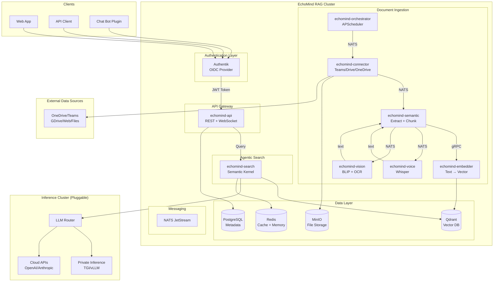

> **Authentication Flow**: Clients authenticate with Authentik (OIDC) first, receive a JWT token, then include it in requests to the API Gateway. The gateway validates the token before forwarding to backend services. This follows the [OAuth 2.0 Resource Server pattern](https://www.solo.io/topics/api-gateway/api-gateway-authentication).

---

## Agentic RAG Flow

The key differentiator from traditional RAG: **the agent decides what to retrieve, when, and whether to retrieve at all**. The `echomind-search` service implements this using Semantic Kernel.

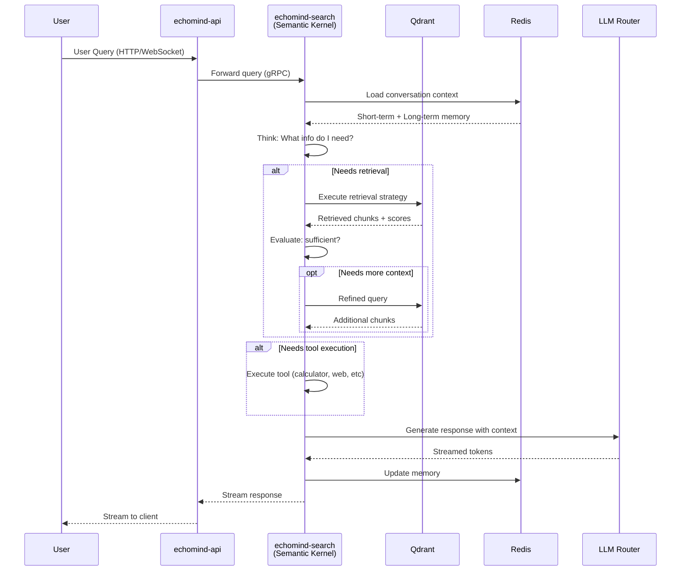

---

## Agent Planning Loop

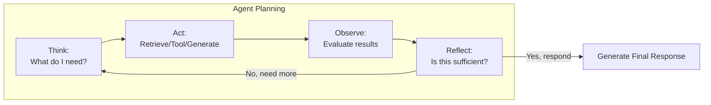

---

## Data Ingestion Pipeline

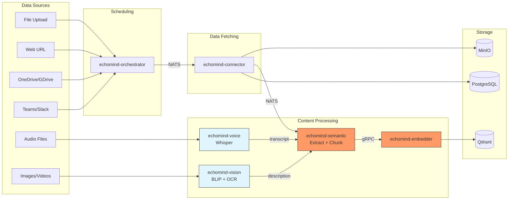

### File Type Routing

| File Type | Route | Processing |
|-----------|-------|------------|
| PDF, DOCX, XLS, MD | Semantic | pymupdf4llm → Markdown → Chunk → Embed |
| URL | Semantic | BS4/Selenium → Text → Chunk → Embed |
| YouTube | Semantic | youtube_transcript_api → Text → Chunk → Embed |
| MP3, WAV, MP4 (audio) | Voice → Semantic | Whisper → Transcript → Chunk → Embed |
| JPEG, PNG (standalone) | Vision → Semantic | BLIP + OCR → Description → Chunk → Embed |
| Video (MP4, etc.) | Vision → Semantic | Frame extraction → BLIP → Description → Chunk → Embed |
| Images in PDF/DOCX | Semantic (LLM) | Handled natively by vision-capable LLM (TBD) |

### Document Processing States

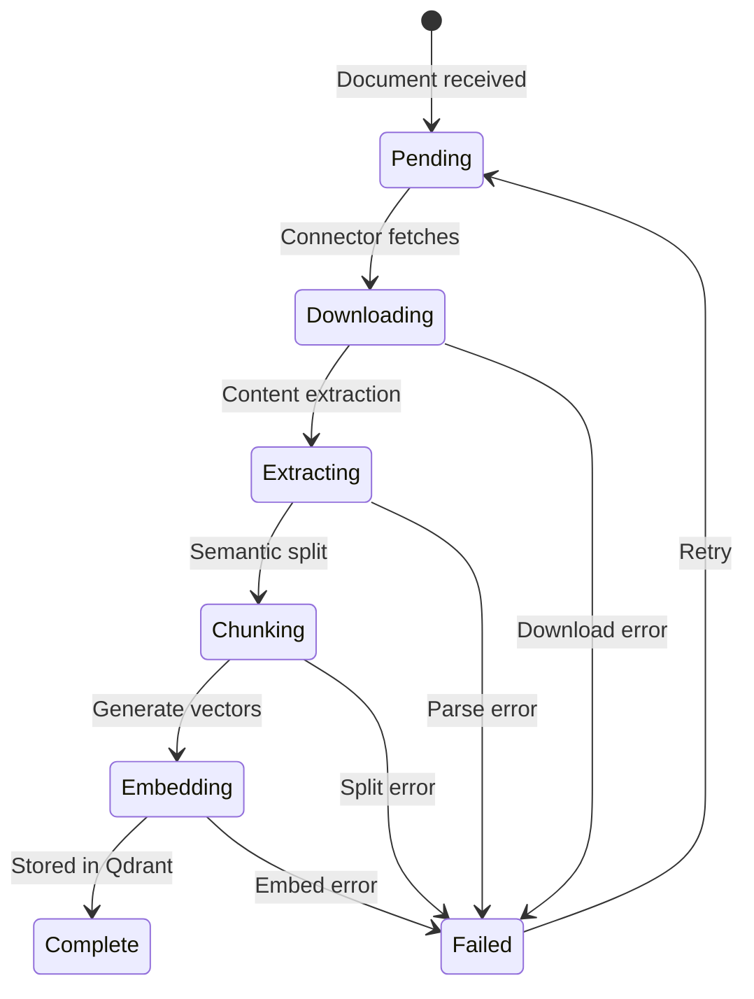

---

## Vector Collection Strategy

Per-user, per-group, and per-org collections enable scoped retrieval. See [Proto Definitions - ConnectorScope](./proto-definitions.md#connectorscope) for scope values.

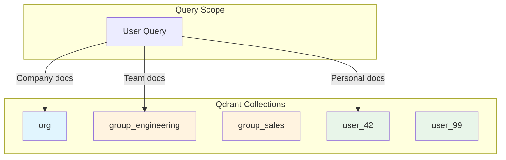

| Scope | Collection Pattern | Example |
|-------|-------------------|---------|
| `user` | `user_{user_id}` | `user_42` |
| `group` | `group_{scope_id}` | `group_engineering` |
| `org` | `org` | `org` |

---

## Memory Architecture

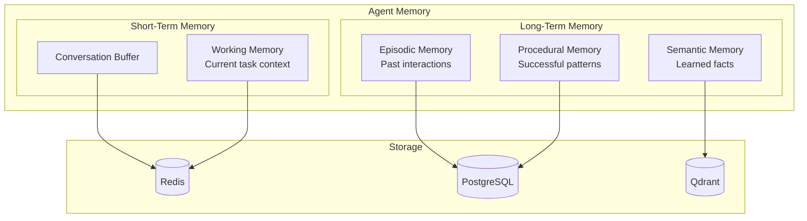

---

## Tool System

The agent can invoke tools during reasoning:

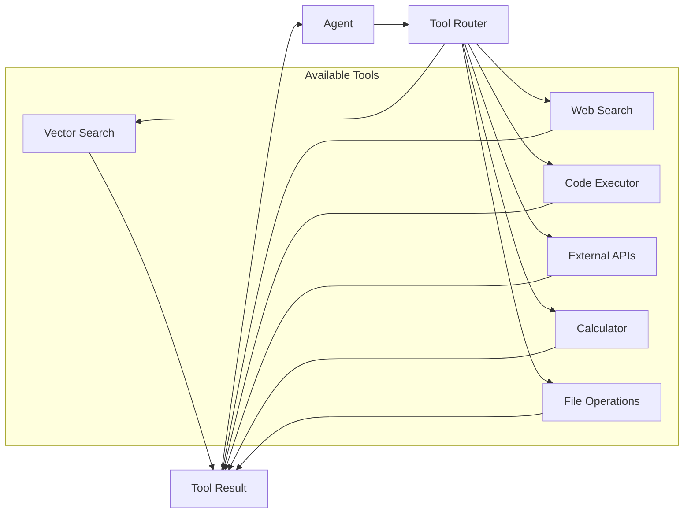

---

## Service Architecture

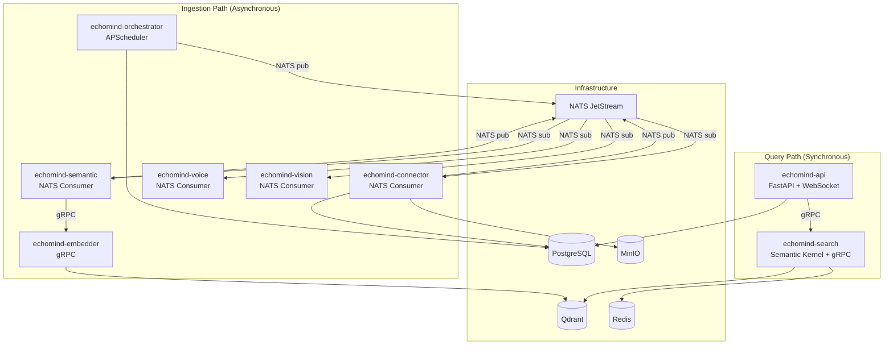

### Services Reference

| Service | Protocol | Port | Purpose |
|---------|----------|------|---------|
| **echomind-api** | HTTP/WebSocket | 8080 | REST API gateway, WebSocket streaming, serves web client |
| **echomind-search** | gRPC | 50051 | Agentic search powered by Semantic Kernel. Handles query planning, multi-step retrieval, tool execution, memory management, and LLM response generation. **Note:** Reranker may become a separate service in the future. |
| **echomind-orchestrator** | NATS (pub) | 8080 | APScheduler-based service that monitors connectors and triggers sync jobs via NATS. See [orchestrator-service.md](./services/orchestrator-service.md). |
| **echomind-connector** | NATS (sub/pub) | 8080 | Fetches data from external sources (Teams, OneDrive, Google Drive). Handles OAuth, delta sync, and file download to MinIO. |
| **echomind-semantic** | NATS (sub/pub) + gRPC | 8080 | Content extraction and text chunking. Uses pymupdf4llm for PDFs, BS4/Selenium for URLs. Supports configurable chunking strategies (character-based or semantic). |
| **echomind-embedder** | gRPC | 50051 | Generates vector embeddings using SentenceTransformers. Supports model caching. |
| **echomind-voice** | NATS (sub) | 8080 | Whisper-based audio transcription for audio files (MP3, WAV). Outputs transcript to semantic service. |
| **echomind-vision** | NATS (sub) | 8080 | BLIP image captioning + OCR for standalone images and video frame extraction. Outputs descriptions to semantic service. |
| **echomind-migration** | Batch job | - | Alembic-based database schema versioning. Runs before service startup. |
| **echomind-guardian** | NATS (sub) | 8080 | Monitors Dead-Letter Queue for failed messages. Sends alerts via configurable alerters (Slack, PagerDuty, logging). Ensures no message is silently lost. |

---

### Service Matrix (Complete)

#### Communication Matrix

| Service | Protocol In | Protocol Out | NATS Subscribe | NATS Publish | gRPC Server | gRPC Client |
|---------|-------------|--------------|----------------|--------------|-------------|-------------|
| **api** | HTTP/WS | gRPC | - | - | - | search |
| **search** | gRPC | - | - | - | `:50051` | - |
| **orchestrator** | - | NATS | - | `connector.sync.*` | - | - |
| **connector** | NATS | NATS | `connector.sync.teams`<br>`connector.sync.onedrive`<br>`connector.sync.google_drive` | `document.process` | - | - |
| **semantic** | NATS | NATS + gRPC | `connector.sync.web`<br>`connector.sync.file`<br>`document.process` | `audio.transcribe`<br>`image.analyze` | - | embedder |
| **embedder** | gRPC | - | - | - | `:50051` | - |
| **voice** | NATS | - | `audio.transcribe` | - | - | - |
| **vision** | NATS | - | `image.analyze` | - | - | - |
| **guardian** | NATS | - | `dlq.>` | - | - | - |
| **migration** | - | - | - | - | - | - |

#### Data Access Matrix

| Service | PostgreSQL | Qdrant | Redis | MinIO | External APIs |
|---------|------------|--------|-------|-------|---------------|
| **api** | R/W (users, connectors, documents, assistants, llms, chat_sessions, chat_messages) | - | - | - | - |
| **search** | R (chat_sessions, chat_messages, assistants, llms) | R (vector search) | R/W (memory) | - | LLM Router |
| **orchestrator** | R/W (connectors, apscheduler_jobs, scheduler_runs) | - | - | - | - |
| **connector** | R/W (connectors, documents) | - | - | W (file upload) | MS Graph, Google Drive API |
| **semantic** | R/W (documents, connectors) | - | - | R (file download) | - |
| **embedder** | - | W (vector upsert) | - | - | - |
| **voice** | W (documents.content) | - | - | R (audio download) | - |
| **vision** | W (documents.content) | - | - | R (image download) | - |
| **guardian** | - (optional: dlq_failures) | - | - | - | Slack, PagerDuty (alerts) |
| **migration** | W (schema DDL) | - | - | - | - |

#### NATS Message Flow (In Order)

```
Step  Publisher      Subject                    Consumer       Trigger
────  ───────────    ─────────────────────────  ─────────────  ──────────────────────────
1     orchestrator   connector.sync.teams       connector      APScheduler (every 60s)
      orchestrator   connector.sync.onedrive    connector      APScheduler (every 60s)
      orchestrator   connector.sync.google_drive connector     APScheduler (every 60s)
      orchestrator   connector.sync.web         semantic       APScheduler (every 60s)
      orchestrator   connector.sync.file        semantic       APScheduler (every 60s)

2     connector      document.process           semantic       After file downloaded to MinIO

3     semantic       audio.transcribe           voice          When MIME = audio/*
      semantic       image.analyze              vision         When MIME = image/* or video/*

4     (voice/vision write directly to DB, semantic reads and continues)

5     semantic → embedder (gRPC, not NATS)
```

#### Consumer Groups

| Service | Durable Name | Queue Group | Subjects |
|---------|--------------|-------------|----------|
| connector | `connector-consumer` | `connector-workers` | `connector.sync.teams`, `connector.sync.onedrive`, `connector.sync.google_drive` |
| semantic | `semantic-consumer` | `semantic-workers` | `connector.sync.web`, `connector.sync.file`, `document.process` |
| voice | `voice-consumer` | `voice-workers` | `audio.transcribe` |
| vision | `vision-consumer` | `vision-workers` | `image.analyze` |
| guardian | `guardian-consumer` | `guardian-workers` | `dlq.>` (ECHOMIND_DLQ stream) |

#### Port Allocation

| Service | Health Check | API/gRPC | WebSocket |
|---------|--------------|----------|-----------|
| api | `:8080/healthz` | `:8080` | `:8080/ws/chat` |
| search | `:8080/healthz` | `:50051` (gRPC) | - |
| orchestrator | `:8080/healthz` | - | - |
| connector | `:8080/healthz` | - | - |
| semantic | `:8080/healthz` | - | - |
| embedder | `:8080/healthz` | `:50051` (gRPC) | - |
| voice | `:8080/healthz` | - | - |
| vision | `:8080/healthz` | - | - |
| guardian | `:8080/healthz` | - | - |
| migration | - (batch job) | - | - |

#### GPU Requirements

| Service | GPU Required | GPU Optional | Model |
|---------|--------------|--------------|-------|
| api | - | - | - |
| search | - | - | - |
| orchestrator | - | - | - |
| connector | - | - | - |
| semantic | - | ✓ (semantic chunking) | all-MiniLM-L6-v2 |
| embedder | - | ✓ (faster encoding) | paraphrase-multilingual-mpnet-base-v2 |
| voice | - | ✓ (10x faster) | Whisper (base/small/medium/large) |
| vision | - | ✓ (10x faster) | BLIP + EasyOCR |
| guardian | - | - | - |
| migration | - | - | - |

#### Unit Testing Requirements

| Service | Test Location | Documentation |
|---------|---------------|---------------|
| api | `tests/unit/services/` | [api-service.md](./services/api-service.md#unit-testing-mandatory) |
| search | `tests/unit/search/` | [search-service.md](./services/search-service.md#unit-testing-mandatory) |
| orchestrator | `tests/unit/orchestrator/` | [orchestrator-service.md](./services/orchestrator-service.md#unit-testing-mandatory) |
| connector | `tests/unit/connector/` | [connector-service.md](./services/connector-service.md#unit-testing-mandatory) |
| semantic | `tests/unit/semantic/` | [semantic-service.md](./services/semantic-service.md#unit-testing-mandatory) |
| embedder | `tests/unit/embedder/` | [embedder-service.md](./services/embedder-service.md#unit-testing-mandatory) |
| voice | `tests/unit/voice/` | [voice-service.md](./services/voice-service.md#unit-testing-mandatory) |
| vision | `tests/unit/vision/` | [vision-service.md](./services/vision-service.md#unit-testing-mandatory) |
| guardian | `tests/unit/guardian/` | [guardian-service.md](./services/guardian-service.md#unit-testing-mandatory) |
| migration | `tests/unit/migration/` | [migration-service.md](./services/migration-service.md#unit-testing-mandatory) |

#### Matrix Accuracy Estimation

| Matrix Section | Confidence | Notes |
|----------------|------------|-------|
| Communication Matrix | **95%** | Verified against nats-messaging.md and all service docs |
| Data Access Matrix | **90%** | Based on service docs; actual code may have additional access patterns |
| NATS Message Flow | **98%** | Directly from nats-messaging.md, well documented |
| Consumer Groups | **98%** | Directly from nats-messaging.md |
| Port Allocation | **95%** | Standard pattern, health on 8080, gRPC on 50051 |
| GPU Requirements | **85%** | Based on ML library docs; actual requirements depend on model size |
| Unit Testing Requirements | **100%** | Links verified to exist in service docs |

**Overall Matrix Accuracy: ~94%**

*Caveats:*
- Voice/Vision response flow (callback vs direct DB write) marked as TBD in docs
- Redis usage by semantic service for chunking cache not confirmed
- Actual database table access may vary based on implementation details

### NATS Subjects

| Subject | Publisher | Consumer | Payload |
|---------|-----------|----------|---------|
| `connector.sync.{type}` | orchestrator | connector | `ConnectorSyncRequest` |
| `document.process` | connector | semantic | `DocumentProcessRequest` |
| `audio.transcribe` | semantic | voice | `AudioTranscribeRequest` |
| `image.analyze` | semantic | vision | `ImageAnalyzeRequest` |

**Proto Messages:** See [Proto Definitions](./proto-definitions.md#internal-proto-definitions) for payload schemas.

---

## Tech Stack

| Layer | Technology | Rationale |
|-------|------------|-----------|
| **API** | FastAPI + WebSocket | Async, streaming, OpenAPI docs |
| **Agent Framework** | Semantic Kernel | Microsoft's AI orchestration SDK, air-gap compatible, Python native |
| **Embeddings** | SentenceTransformers | Local, configurable per cluster |
| **Vector DB** | Qdrant | High-performance, HNSW indexes, rich filtering, Rust-based |
| **Relational DB** | PostgreSQL | Reliable, JSONB support |
| **Cache/Memory** | Redis | Fast, pub/sub, streams |
| **Object Storage** | MinIO ⚠️ | S3-compatible, self-hosted (see warning below) |
| **Message Queue** | NATS JetStream | Lightweight, persistent |
| **LLM Private** | TGI / vLLM | Production-grade inference, GPU optimized |
| **LLM Cloud** | OpenAI / Anthropic | Optional, for connected deployments |
| **Auth** | Authentik | SSO, OIDC, self-hosted, inside cluster |
| **Observability** | OpenTelemetry + Grafana | Traces, metrics, logs |

### ⚠️ Object Storage Warning: MinIO

> **Warning**: MinIO is currently under maintenance mode and is not accepting new changes. This may impact long-term support and security updates.

**Recommended Alternative**: [RustFS](https://github.com/rustfs/rustfs) - A high-performance, S3-compatible object storage written in Rust. Benefits:
- Active development
- Rust-based (memory safe, high performance)
- S3-compatible API
- Better suited for air-gapped deployments

**Decision**: Evaluate RustFS as primary object storage. If not mature enough for v1, use MinIO with migration path to RustFS planned.

---

### Flexible Deployment: Cloud, Hybrid, or Air-Gapped

EchoMind is designed to run anywhere—from public cloud to the most restricted environments. Whether you're deploying in AWS/Azure/GCP, a private data center, or a fully air-gapped SCIF facility, EchoMind adapts to your security requirements.

| Deployment Mode | Description |
|-----------------|-------------|
| **Cloud** | Full SaaS experience with cloud LLMs (OpenAI, Anthropic) and managed services |
| **Hybrid** | Private RAG cluster with optional cloud LLM fallback |
| **Air-Gapped** | Fully disconnected, meets SCIF standards, zero external dependencies |

#### Air-Gapped Compliance

For classified networks and air-gapped data centers, EchoMind provides:

| Requirement | Solution |
|-------------|----------|
| No internet access | All dependencies pre-packaged, offline container images |
| No telemetry/phone-home | Semantic Kernel runs fully offline, no hidden network calls |
| Private LLM inference | TGI/vLLM with pre-downloaded models |
| Local embeddings | SentenceTransformers with cached models |
| Self-contained auth | Authentik inside cluster, LDAP/AD integration |
| Audit compliance | Full request/response logging, no data exfiltration |

### Why Semantic Kernel

[Semantic Kernel](https://github.com/microsoft/semantic-kernel) is Microsoft's open-source AI orchestration SDK:

- **Air-gap compatible**: No telemetry, no phone-home, works fully offline
- **Python native**: First-class Python support alongside C# and Java
- **Pluggable connectors**: Easy to swap LLM providers (local or cloud)
- **Memory & planning**: Built-in support for agent memory and multi-step planning
- **Enterprise-ready**: Backed by Microsoft, used in production at scale
- **Auditable**: Clean dependency tree, no hidden LangChain-style network calls

### Embedding Model Configuration

Embedding model is **cluster-wide** and configured via environment variables:

```bash
# .env or ConfigMap
ECHOMIND_EMBEDDING_MODEL=sentence-transformers/paraphrase-multilingual-mpnet-base-v2
ECHOMIND_EMBEDDING_DIMENSION=768
```

**Important**: Changing the embedding model requires:
1. Delete all vectors from Qdrant
2. Mark all documents as `pending`
3. Re-scan all data sources
4. Re-embed all documents

This is enforced at startup: if model config changes, system blocks until admin confirms re-indexing.

### Chunking Configuration (Semantic Service)

The semantic service supports configurable chunking strategies:

```bash
# .env or ConfigMap
SEMANTIC_CHUNK_STRATEGY=character          # character | semantic
SEMANTIC_CHUNK_SIZE=1000                   # Characters per chunk
SEMANTIC_CHUNK_OVERLAP=200                 # Overlap between chunks
SEMANTIC_CHUNK_MODEL=sentence-transformers/all-MiniLM-L6-v2  # For semantic chunking
```

| Strategy | Description | Use Case |
|----------|-------------|----------|
| **character** | RecursiveCharacterTextSplitter, splits on paragraph/sentence boundaries | Default, fast, predictable |
| **semantic** | ML-based, uses embedding similarity to find natural breakpoints | Better coherence, higher compute cost |

---

## Deployment Modes

### Single Container (Development)

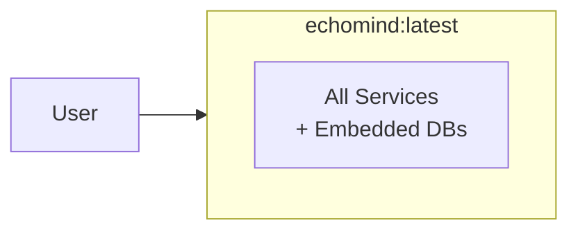

### Docker Compose (Small Scale)

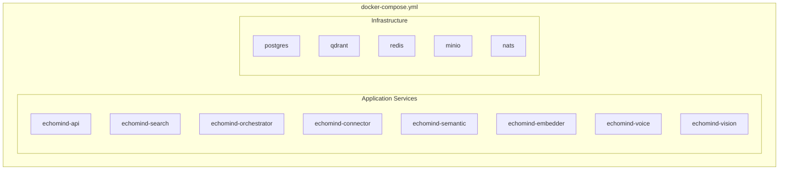

### Kubernetes (Production)

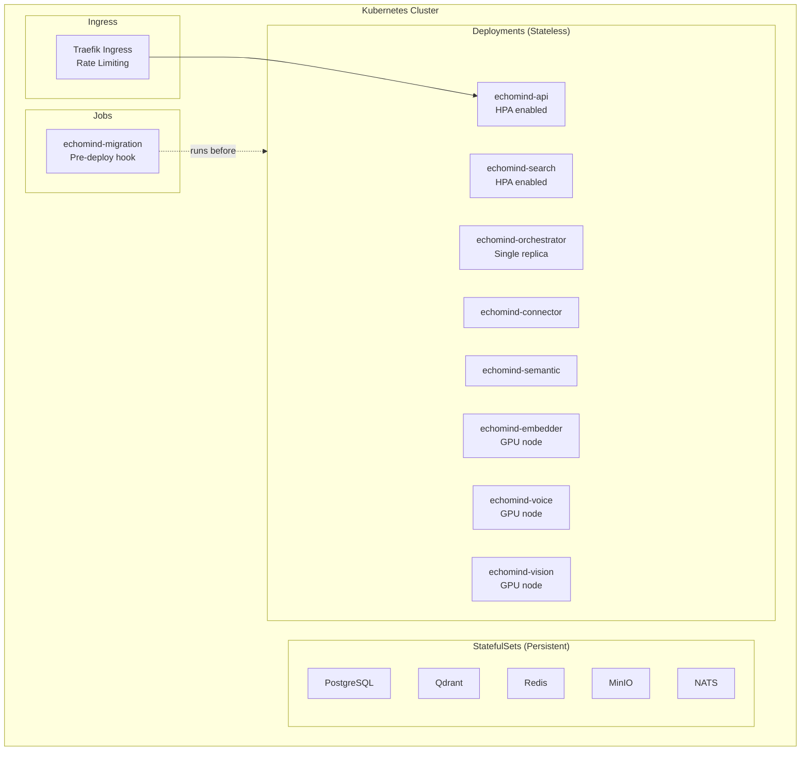

---

## Directory Structure

```
echomind/
├── docs/                    # Documentation
│   ├── architecture.md      # This file
│   └── services/            # Service-specific docs
├── src/
│   ├── api/                 # FastAPI REST + WebSocket gateway
│   │   ├── routes/
│   │   ├── middleware/
│   │   └── websocket/
│   ├── services/            # Background services
│   │   ├── search/          # Agentic search (Semantic Kernel, gRPC)
│   │   │   ├── logic/       # SK plugins, tools, memory
│   │   │   └── main.py
│   │   ├── orchestrator/    # Scheduler service (APScheduler, NATS pub)
│   │   │   ├── logic/
│   │   │   │   └── jobs/    # connector_sync.py, cleanup.py
│   │   │   └── main.py
│   │   ├── connector/       # Data source connector (NATS sub)
│   │   │   ├── logic/
│   │   │   │   └── providers/  # onedrive.py, teams.py, gdrive.py
│   │   │   └── main.py
│   │   ├── semantic/        # Content extraction + chunking (NATS sub)
│   │   │   ├── logic/
│   │   │   │   ├── extractors/  # pdf.py, url.py, youtube.py
│   │   │   │   └── chunkers/    # character.py, semantic.py
│   │   │   └── main.py
│   │   ├── embedder/        # Text → Vector (gRPC)
│   │   │   ├── logic/
│   │   │   └── main.py
│   │   ├── voice/           # Whisper transcription (NATS sub)
│   │   │   ├── logic/
│   │   │   └── main.py
│   │   ├── vision/          # BLIP + OCR (NATS sub)
│   │   │   ├── logic/
│   │   │   └── main.py
│   │   └── migration/       # Alembic migrations (batch job)
│   │       └── versions/
│   ├── proto/               # Protocol Buffer definitions (source of truth)
│   │   ├── public/          # Client-facing API objects
│   │   └── internal/        # Internal service objects
│   ├── echomind_lib/        # SHARED LIBRARY
│   │   ├── db/              # Database clients
│   │   │   ├── models/      # SQLAlchemy ORM models
│   │   │   ├── postgres.py
│   │   │   ├── qdrant.py
│   │   │   └── nats_*.py
│   │   ├── helpers/         # Utility code
│   │   └── models/          # AUTO-GENERATED (from proto)
│   └── web/                 # React client
├── deployment/
│   ├── docker/
│   │   ├── Dockerfile.*     # Per-service Dockerfiles
│   │   └── docker-compose.yml
│   └── k8s/
│       ├── base/            # Kustomize base
│       └── overlays/        # dev, staging, prod
├── config/                  # Configuration files
├── tests/
└── scripts/
```

---

## Next Steps

1. **Phase 1**: Core infrastructure (API, DB connections, auth)
2. **Phase 2**: Document ingestion pipeline (connectors, chunking, embedding)
3. **Phase 3**: Basic RAG (search, retrieval, generation)
4. **Phase 4**: Agent capabilities (planning, memory, tools)
5. **Phase 5**: Production hardening (observability, scaling)

---

## Future Vision

### Agentic Ingestion Pipeline

Future enhancement: use an LLM to reason about documents during ingestion, not just retrieval.

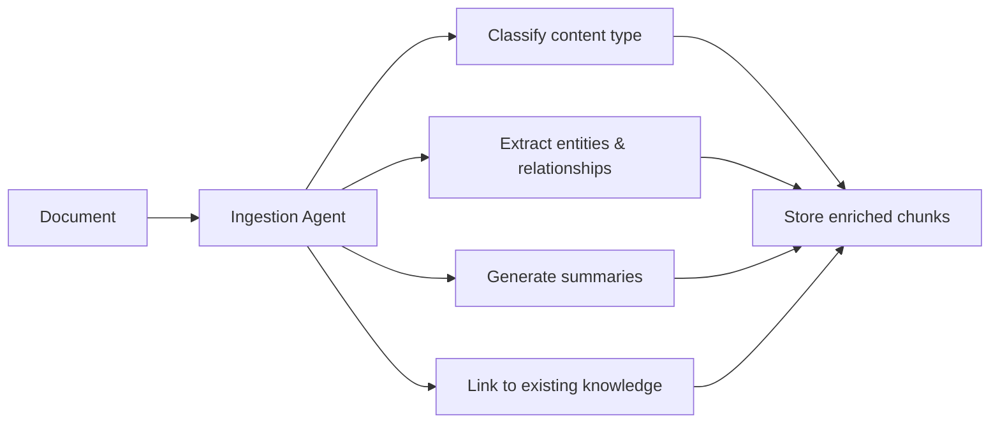

Benefits:
- Automatic document classification and tagging
- Entity extraction and knowledge graph building
- Multi-level summaries (document, section, paragraph)
- Cross-document relationship discovery

### Real-Time Voice (Future)

Current scope: audio file transcription (batch processing).

Future scope: real-time voice streaming for live conversations:
- WebSocket audio streaming to voice service
- Live transcription with speaker diarization
- Real-time agent responses via voice synthesis
- Use case: voice-enabled AI assistant in Teams calls

### Reranker Service (TBD)

May extract reranking into a separate service if:
- Cross-encoder models prove computationally expensive
- Need to A/B test different reranking strategies
- Want to cache reranking results independently

Current approach: reranking logic lives in `echomind-search` service.

---

## Decisions Made

- [x] **Agent framework**: Semantic Kernel (Microsoft's AI orchestration SDK, air-gap compatible)
- [x] **Vector database**: Qdrant (high-performance, HNSW, rich filtering)
- [x] **Embedding model**: Cluster-wide config via env vars, requires re-index on change
- [x] **Deployment targets**: Single container, Docker Compose, Kubernetes
- [x] **Deployment modes**: Cloud, Hybrid, or Air-Gapped (SCIF compliant)
- [x] **LLM strategy**: Private inference (TGI/vLLM), cloud optional for connected envs
- [x] **Auth**: Authentik (self-hosted, OIDC/LDAP, inside RAG cluster)
- [x] **Tenancy**: Single-tenant with per-user/group/org vector collections

## Open Questions

- [ ] Memory persistence strategy (how long to retain episodic memory?) — **TBD**
- [ ] Reranker: Keep in `echomind-search` or extract to separate `echomind-reranker` service? — **TBD, see Future Vision**
- [ ] Object storage selection: MinIO (maintenance mode) vs [RustFS](https://github.com/rustfs/rustfs) — **Evaluate**
- [ ] Stuck connector handling: Should orchestrator reset connectors stuck in PENDING/SYNCING? — **TBD, see [orchestrator-service.md](./services/orchestrator-service.md)**
- [ ] Video audio extraction: Process in vision service or route to voice service? — **TBD, depends on model**

## Resolved

- [x] **Offline dependency bundling**: Docker images from authorized container registries, deployable to [Iron Bank (Platform One)](https://p1.dso.mil/iron-bank)
- [x] **Connector priority for v1**: Microsoft Teams, Google Drive

---

## References

- [Proto Definitions](./proto-definitions.md) - Enum values, message schemas, NATS payloads
- [DB Schema](./db-schema.md) - PostgreSQL table definitions
- [API Specification](./api-spec.md) - REST/WebSocket endpoints
- [NATS Messaging](./nats-messaging.md) - Message flow and stream configuration
- [Orchestrator Service](./services/orchestrator-service.md) - Scheduler service details
- [Guardian Service](./services/guardian-service.md) - DLQ monitoring and alerting
