# EchoMind - Agentic RAG Architecture

> Technical specification for EchoMind, a Python-based Agentic Retrieval-Augmented Generation platform.

## Overview

EchoMind is an **Agentic RAG** system that goes beyond traditional retrieve-then-generate patterns. The agent reasons about what information it needs, plans multi-step retrieval strategies, uses external tools, and maintains memory across sessions.

---

## High-Level Architecture

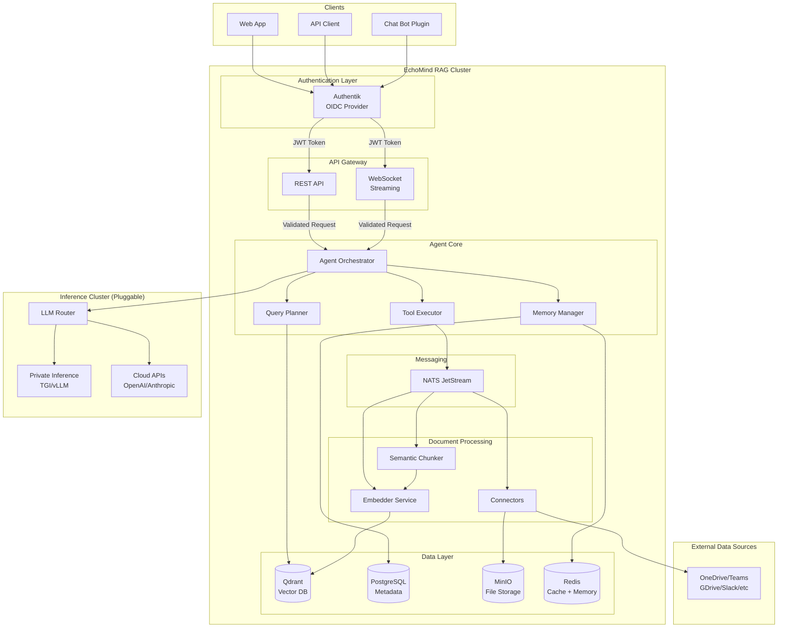

> **Authentication Flow**: Clients authenticate with Authentik (OIDC) first, receive a JWT token, then include it in requests to the API Gateway. The gateway validates the token before forwarding to backend services. This follows the [OAuth 2.0 Resource Server pattern](https://www.solo.io/topics/api-gateway/api-gateway-authentication).

---

## Agentic RAG Flow

The key differentiator from traditional RAG: **the agent decides what to retrieve, when, and whether to retrieve at all**.

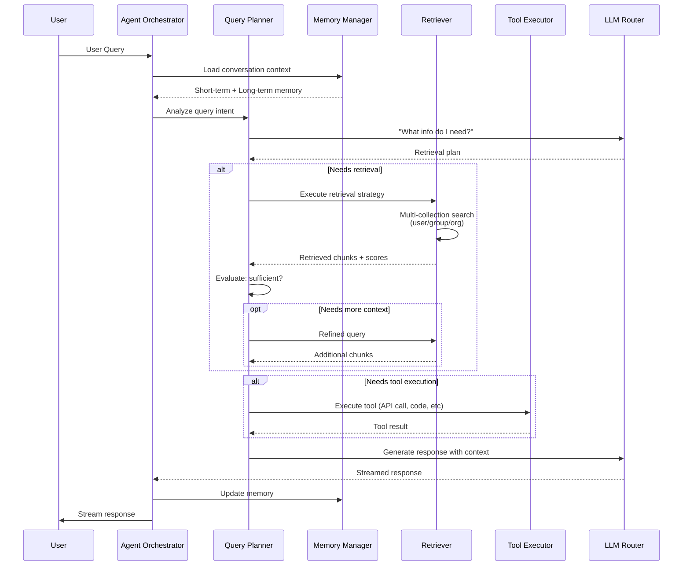

---

## Agent Planning Loop

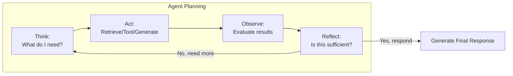

---

## Data Ingestion Pipeline

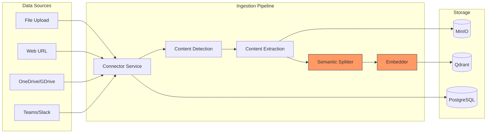

### Document Processing States

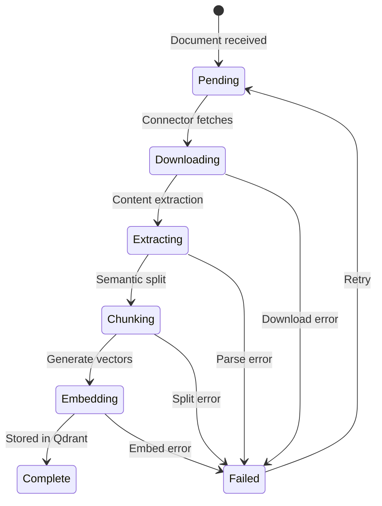

---

## Vector Collection Strategy

Per-user, per-group, and per-org collections enable scoped retrieval:

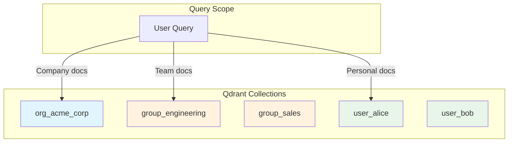

---

## Memory Architecture

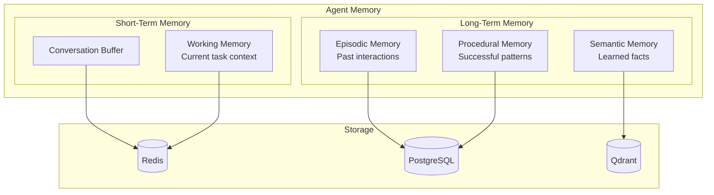

---

## Tool System

The agent can invoke tools during reasoning:

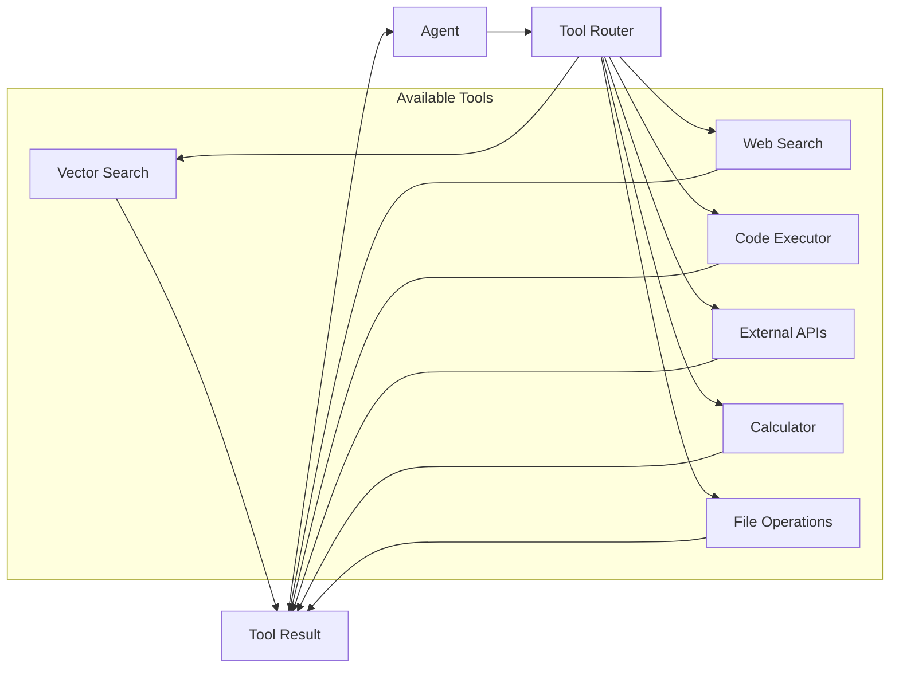

---

## Service Architecture

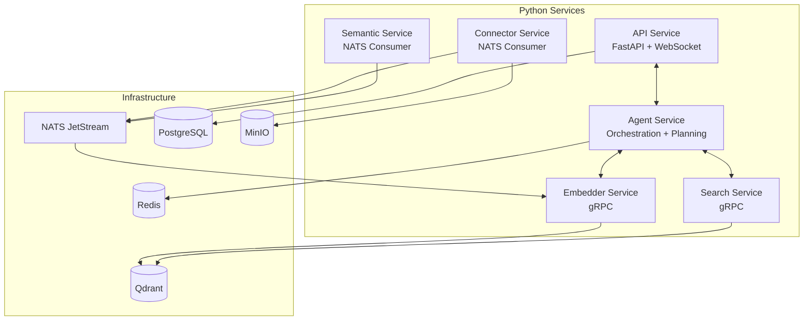

---

## Tech Stack

| Layer | Technology | Rationale |
|-------|------------|-----------|
| **API** | FastAPI + WebSocket | Async, streaming, OpenAPI docs |
| **Agent Framework** | Semantic Kernel | Microsoft's AI orchestration SDK, air-gap compatible, Python native |
| **Embeddings** | SentenceTransformers | Local, configurable per cluster |
| **Vector DB** | Qdrant | High-performance, HNSW indexes, rich filtering, Rust-based |
| **Relational DB** | PostgreSQL | Reliable, JSONB support |
| **Cache/Memory** | Redis | Fast, pub/sub, streams |
| **Object Storage** | MinIO ⚠️ | S3-compatible, self-hosted (see warning below) |
| **Message Queue** | NATS JetStream | Lightweight, persistent |
| **LLM Private** | TGI / vLLM | Production-grade inference, GPU optimized |
| **LLM Cloud** | OpenAI / Anthropic | Optional, for connected deployments |
| **Auth** | Authentik | SSO, OIDC, self-hosted, inside cluster |
| **Observability** | OpenTelemetry + Grafana | Traces, metrics, logs |

### ⚠️ Object Storage Warning: MinIO

> **Warning**: MinIO is currently under maintenance mode and is not accepting new changes. This may impact long-term support and security updates.

**Recommended Alternative**: [RustFS](https://github.com/rustfs/rustfs) - A high-performance, S3-compatible object storage written in Rust. Benefits:
- Active development
- Rust-based (memory safe, high performance)
- S3-compatible API
- Better suited for air-gapped deployments

**Decision**: Evaluate RustFS as primary object storage. If not mature enough for v1, use MinIO with migration path to RustFS planned.

---

### Flexible Deployment: Cloud, Hybrid, or Air-Gapped

EchoMind is designed to run anywhere—from public cloud to the most restricted environments. Whether you're deploying in AWS/Azure/GCP, a private data center, or a fully air-gapped SCIF facility, EchoMind adapts to your security requirements.

| Deployment Mode | Description |
|-----------------|-------------|
| **Cloud** | Full SaaS experience with cloud LLMs (OpenAI, Anthropic) and managed services |
| **Hybrid** | Private RAG cluster with optional cloud LLM fallback |
| **Air-Gapped** | Fully disconnected, meets SCIF standards, zero external dependencies |

#### Air-Gapped Compliance

For classified networks and air-gapped data centers, EchoMind provides:

| Requirement | Solution |
|-------------|----------|
| No internet access | All dependencies pre-packaged, offline container images |
| No telemetry/phone-home | Semantic Kernel runs fully offline, no hidden network calls |
| Private LLM inference | TGI/vLLM with pre-downloaded models |
| Local embeddings | SentenceTransformers with cached models |
| Self-contained auth | Authentik inside cluster, LDAP/AD integration |
| Audit compliance | Full request/response logging, no data exfiltration |

### Why Semantic Kernel

[Semantic Kernel](https://github.com/microsoft/semantic-kernel) is Microsoft's open-source AI orchestration SDK:

- **Air-gap compatible**: No telemetry, no phone-home, works fully offline
- **Python native**: First-class Python support alongside C# and Java
- **Pluggable connectors**: Easy to swap LLM providers (local or cloud)
- **Memory & planning**: Built-in support for agent memory and multi-step planning
- **Enterprise-ready**: Backed by Microsoft, used in production at scale
- **Auditable**: Clean dependency tree, no hidden LangChain-style network calls

### Embedding Model Configuration

Embedding model is **cluster-wide** and configured via environment variables:

```bash
# .env or ConfigMap
ECHOMIND_EMBEDDING_MODEL=sentence-transformers/paraphrase-multilingual-mpnet-base-v2
ECHOMIND_EMBEDDING_DIMENSION=768
```

**Important**: Changing the embedding model requires:
1. Delete all vectors from Qdrant
2. Mark all documents as `pending`
3. Re-scan all data sources
4. Re-embed all documents

This is enforced at startup: if model config changes, system blocks until admin confirms re-indexing.

---

## Deployment Modes

### Single Container (Development)

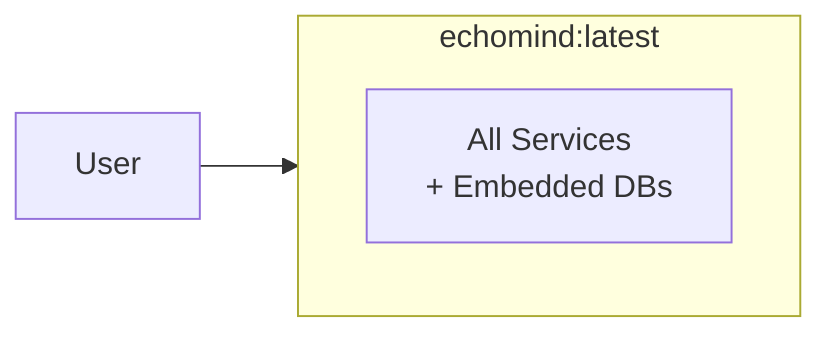

### Docker Compose (Small Scale)

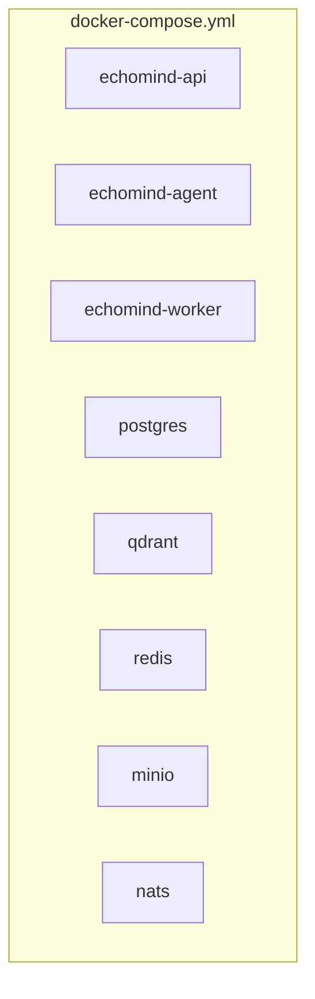

### Kubernetes (Production)

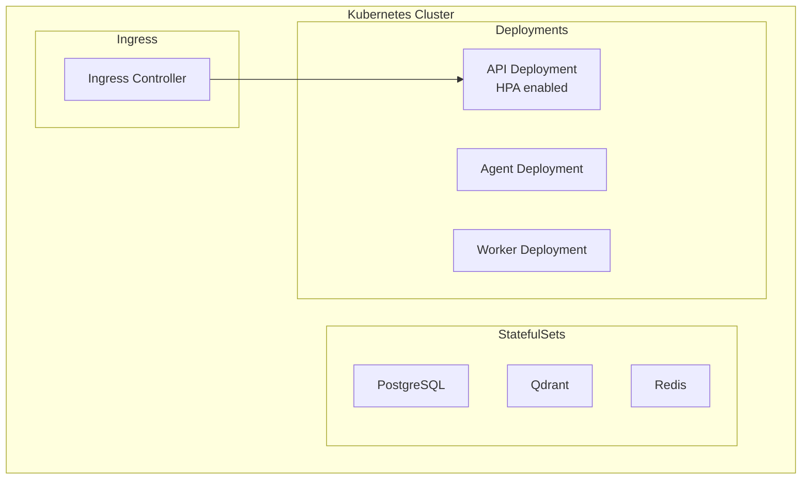

---

## Directory Structure (Proposed)

```
echomind/
├── docs/                    # Documentation
│   ├── architecture.md      # This file
│   └── api/                 # API documentation
├── src/
│   ├── api/                 # FastAPI application
│   │   ├── routes/
│   │   ├── middleware/
│   │   └── websocket/
│   ├── agent/               # Agent core
│   │   ├── orchestrator.py
│   │   ├── planner.py
│   │   ├── memory/
│   │   └── tools/
│   ├── services/            # Background services
│   │   ├── embedder/
│   │   ├── semantic/
│   │   ├── connector/
│   │   └── search/
│   ├── connectors/          # Data source connectors
│   │   ├── onedrive/
│   │   ├── teams/
│   │   ├── web/
│   │   └── file/
│   ├── db/                  # Database clients
│   │   ├── postgres.py
│   │   ├── qdrant.py
│   │   ├── redis.py
│   │   └── minio.py
│   ├── models/              # Pydantic models
│   ├── proto/               # gRPC definitions
│   └── lib/                 # Shared utilities
├── deployment/
│   ├── docker/
│   │   ├── Dockerfile
│   │   └── docker-compose.yml
│   └── k8s/
│       └── manifests/
├── config/                  # Configuration files
├── tests/
└── scripts/
```

---

## Next Steps

1. **Phase 1**: Core infrastructure (API, DB connections, auth)
2. **Phase 2**: Document ingestion pipeline (connectors, chunking, embedding)
3. **Phase 3**: Basic RAG (search, retrieval, generation)
4. **Phase 4**: Agent capabilities (planning, memory, tools)
5. **Phase 5**: Production hardening (observability, scaling)

---

## Decisions Made

- [x] **Agent framework**: Semantic Kernel (Microsoft's AI orchestration SDK, air-gap compatible)
- [x] **Vector database**: Qdrant (high-performance, HNSW, rich filtering)
- [x] **Embedding model**: Cluster-wide config via env vars, requires re-index on change
- [x] **Deployment targets**: Single container, Docker Compose, Kubernetes
- [x] **Deployment modes**: Cloud, Hybrid, or Air-Gapped (SCIF compliant)
- [x] **LLM strategy**: Private inference (TGI/vLLM), cloud optional for connected envs
- [x] **Auth**: Authentik (self-hosted, OIDC/LDAP, inside RAG cluster)
- [x] **Tenancy**: Single-tenant with per-user/group/org vector collections

## Open Questions

- [ ] Memory persistence strategy (how long to retain episodic memory?) — **TBD**
- [ ] Reranker strategy (cross-encoder model selection, when to apply reranking?) — **TBD**
- [ ] Object storage selection: MinIO (maintenance mode) vs [RustFS](https://github.com/rustfs/rustfs) — **Evaluate**

## Resolved

- [x] **Offline dependency bundling**: Docker images from authorized container registries, deployable to [Iron Bank (Platform One)](https://p1.dso.mil/iron-bank)
- [x] **Connector priority for v1**: Microsoft Teams, Google Drive
