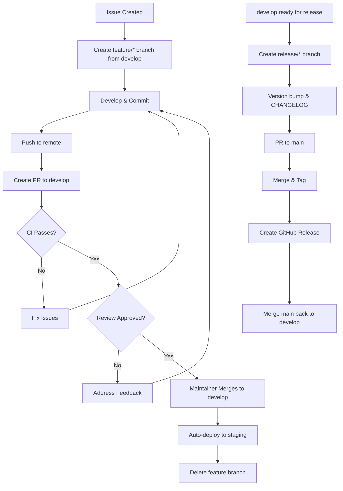

# Git Workflow & Branch Strategy

This document describes EchoMind's Git branching strategy and development workflow.

## 📊 Branch Strategy

We use a **simplified GitHub Flow with staging** approach:

```
main (production releases)
 ↑ (PR with release tag)
develop (staging/integration - auto-deploys to demo.echomind.ch)
 ↑ (PR from feature branches)
feature/* (developer work)
```

### Branch Descriptions

| Branch | Purpose | Protected | Deploy Target |
|--------|---------|-----------|---------------|
| `main` | Production-ready code, tagged releases | ✅ Yes | Production (manual) |
| `develop` | Integration/staging branch | ✅ Yes | demo.echomind.ch (auto) |
| `feature/*` | Active development work | ❌ No | Local only |
| `fix/*` | Bug fixes | ❌ No | Local only |
| `hotfix/*` | Critical production fixes | ❌ No | Emergency only |

---

## 🔄 Developer Workflow

### 1. Pick a Task

- Find an issue in [GitHub Issues](https://github.com/gen-mind/echo-mind/issues)
- Assign yourself to the issue
- Comment on the issue to claim it

### 2. Create Feature Branch

```bash
# Ensure develop is up-to-date
git checkout develop
git pull origin develop

# Create your feature branch
git checkout -b feature/descriptive-name

# Examples:
# feature/add-langfuse-integration
# fix/healthcheck-localhost-error
# docs/update-api-documentation
```

### 3. Develop & Commit

```bash
# Make changes
# ...

# Stage changes
git add .

# Commit with conventional commit message
git commit -m "feat(api): add document upload endpoint"

# Push to your fork/branch
git push origin feature/descriptive-name
```

**Commit often!** Small, focused commits are better than large ones.

### 4. Keep Branch Updated

```bash
# Rebase on develop regularly to avoid conflicts
git checkout develop
git pull origin develop
git checkout feature/descriptive-name
git rebase develop

# If conflicts, resolve them:
# 1. Fix conflicts in files
# 2. git add <resolved-files>
# 3. git rebase --continue

# Force push (only on YOUR feature branch)
git push origin feature/descriptive-name --force-with-lease
```

### 5. Create Pull Request

When your feature is ready:

1. **Push final changes:**
   ```bash
   git push origin feature/descriptive-name
   ```

2. **Open PR on GitHub:**
   - Go to https://github.com/gen-mind/echo-mind
   - Click "Pull Requests" → "New Pull Request"
   - **Base:** `develop` (NOT `main`!)
   - **Compare:** `your-username:feature/descriptive-name`
   - Fill in the PR template
   - Add labels (`enhancement`, `bug`, `documentation`, etc.)
   - Request review from maintainers

3. **Wait for CI:**
   - GitHub Actions will run tests automatically
   - Fix any failing tests
   - Address review comments

4. **Merge:**
   - Once approved + CI passes, maintainer will merge
   - Your branch will be deleted automatically

---

## 🚀 Release Workflow

### Creating a Release (Maintainers Only)

```bash
# 1. Create release branch from develop
git checkout develop
git pull origin develop
git checkout -b release/v1.2.0

# 2. Update version numbers
# - Update CHANGELOG.md with release notes
# - Update version in pyproject.toml, package.json, etc.

# 3. Commit version bump
git commit -am "chore: bump version to 1.2.0"

# 4. Open PR to main
# Base: main
# Compare: release/v1.2.0

# 5. After PR approved and merged to main:
git checkout main
git pull origin main
git tag -a v1.2.0 -m "Release v1.2.0"
git push origin v1.2.0

# 6. Merge main back to develop
git checkout develop
git merge main
git push origin develop

# 7. Create GitHub Release
# - Go to GitHub Releases
# - Create release from tag v1.2.0
# - Copy CHANGELOG.md entries
# - Publish release
```

---

## 🔥 Hotfix Workflow

For critical production bugs:

```bash
# 1. Create hotfix branch from main
git checkout main
git pull origin main
git checkout -b hotfix/critical-security-fix

# 2. Fix the bug
# ...

# 3. Commit fix
git commit -am "fix: patch critical security vulnerability"

# 4. Open PR to main (emergency fast-track)
# Base: main
# Compare: hotfix/critical-security-fix

# 5. After merge to main, cherry-pick to develop
git checkout develop
git cherry-pick <commit-hash>
git push origin develop
```

---

## 📋 Branch Protection Rules

### `main` Branch

**Settings → Branches → Add rule for `main`:**

- ✅ Require pull request before merging
  - ✅ Require approvals: **1**
  - ✅ Dismiss stale approvals when new commits are pushed
  - ✅ Require review from Code Owners (if CODEOWNERS file exists)
- ✅ Require status checks to pass
  - ✅ Require branches to be up to date
  - ✅ Status checks: `test-python`, `test-web`, `lint`, `build`
- ✅ Require conversation resolution before merging
- ✅ Require signed commits (recommended)
- ✅ Require linear history (enforce rebase/squash)
- ✅ Include administrators (enforce for everyone)
- ❌ Allow force pushes: **Never**
- ❌ Allow deletions: **Never**

### `develop` Branch

**Settings → Branches → Add rule for `develop`:**

- ✅ Require pull request before merging
  - ✅ Require approvals: **1**
  - ✅ Dismiss stale approvals when new commits are pushed
- ✅ Require status checks to pass
  - ✅ Require branches to be up to date
  - ✅ Status checks: `test-python`, `test-web`, `lint`
- ✅ Require conversation resolution before merging
- ✅ Require linear history
- ❌ Allow force pushes: **Never**
- ❌ Allow deletions: **Never**

---

## 🤖 GitHub Actions

CI/CD runs automatically on all PRs to `develop` and `main`.

### Workflows

| Workflow | Trigger | Purpose |
|----------|---------|---------|
| `test.yml` | PR to develop/main | Run Python + JS tests |
| `lint.yml` | PR to develop/main | Run linters, type checks |
| `build.yml` | PR to develop/main | Build Docker images |
| `deploy-staging.yml` | Merge to develop | Deploy to demo.echomind.ch |
| `release.yml` | Tag push (v*) | Build & publish release |

### Status Checks

All PRs must pass these checks:

- ✅ **test-python** - Python unit tests (pytest)
- ✅ **test-web** - WebUI tests (Jest/Vitest)
- ✅ **lint-python** - Ruff linter, mypy type checking
- ✅ **lint-web** - ESLint, Prettier
- ✅ **build** - Docker images build successfully
- ✅ **proto-check** - Proto files properly generated

---

## 📊 Branch Lifecycle



---

## 🛠️ Troubleshooting

### Merge Conflicts

```bash
# Update your branch with latest develop
git checkout develop
git pull origin develop
git checkout feature/your-branch
git rebase develop

# Fix conflicts in editor
# Then:
git add <resolved-files>
git rebase --continue

# Force push (safe with --force-with-lease)
git push origin feature/your-branch --force-with-lease
```

### Accidentally Committed to Wrong Branch

```bash
# Save your changes
git stash

# Switch to correct branch
git checkout -b feature/correct-branch develop

# Apply your changes
git stash pop
```

### PR Shows Too Many Commits

```bash
# Interactive rebase to squash commits
git rebase -i develop

# In editor, change 'pick' to 'squash' for commits to merge
# Force push
git push origin feature/your-branch --force-with-lease
```

---

## 📚 References

- [GitHub Branch Protection](https://docs.github.com/en/repositories/configuring-branches-and-merges-in-your-repository/managing-protected-branches/about-protected-branches)
- [Conventional Commits](https://www.conventionalcommits.org/)
- [Semantic Versioning](https://semver.org/)
- [GitHub Flow](https://docs.github.com/en/get-started/quickstart/github-flow)

---

**Questions?** Open a [Discussion](https://github.com/gen-mind/echo-mind/discussions) or ask in PR comments.
