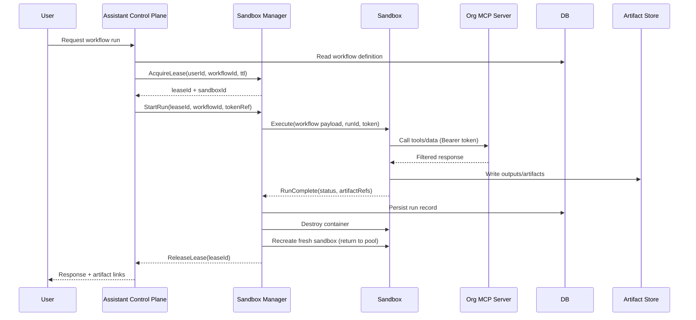
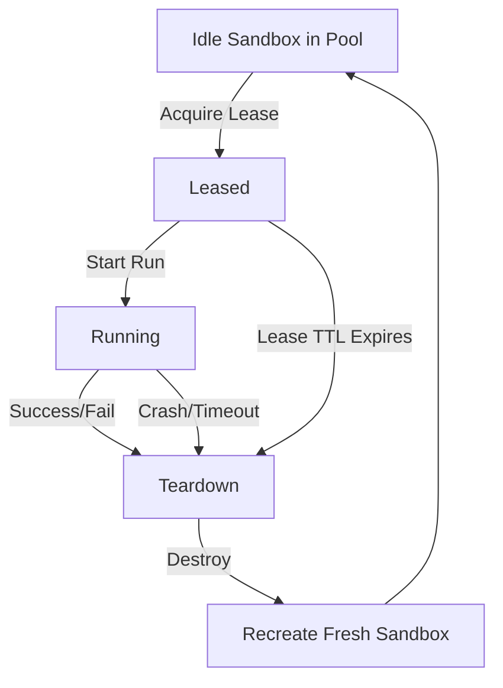

# Personal Assistant Sandbox Execution Platform — Spec (MVP / Docker Compose)

> **Status:** Draft  
> **Scope:** Single-host Docker Compose MVP (no Swarm, no Kubernetes)  
> **Primary goal:** Provide **ephemeral per-user sandboxes** to execute AI-generated workflows that access org tools/data through **MCP** with **delegated authorization**.

---

## 1. Purpose

This document specifies the MVP architecture and runtime behavior for a Personal Assistant platform that:
- uses RAG to help users create workflows
- executes workflows in **exclusive, ephemeral sandboxes**
- accesses organization data/tools via **MCP** using user-scoped authorization
- persists workflow definitions and outputs externally
- destroys and recreates sandbox containers to guarantee a clean environment between runs

---

## 2. Goals and Non-goals

### 2.1 Goals (MVP)
- **Ephemeral sandbox execution**: one user at a time per sandbox, exclusive lease.
- **Delegated authorization**: sandbox calls MCP servers with a user-scoped token; MCP enforces filtering/permissions.
- **Externalized state**: workflow definitions in DB; artifacts in object store; sandbox filesystem disposable.
- **Warm pool**: maintain a fixed number of pre-created sandboxes ready for assignment.
- **Simple Docker Compose deployment** on a single host.

### 2.2 Non-goals (MVP)
- No Kubernetes deployment (add later).
- No Swarm.
- No internal mTLS / workload identity enforcement (add later).
- No strict egress controls (sandbox can access internal + internet).
- No advanced Docker hardening beyond “internal container, not exposed”.

---

## 3. Definitions

- **Assistant Control Plane (ACP):** RAG + orchestration layer. Authenticates users, stores workflows, triggers runs.
- **note about AGP** AGP is the agent that decides how to create the workflow, test it and then saves all the metadata so it can be reused
- **workflow templates** a collection of workflow or idea to automate the work
- **Sandbox Manager (SM):** Manages sandbox lifecycle, pool, leasing, and run execution.
- **Sandbox (SB):** Container environment where workflow code runs (Python + base packages + MCP client capability).
- **Lease:** Exclusive reservation of a sandbox for one user/run with TTL + heartbeat.
- **Workflow:** A persisted definition created by the assistant (e.g., steps, code, tool calls, schedule).
- **Cron Workflow:** Workflow scheduled for recurring execution by a separate runner process.
- **MCP Server:** Organization service exposing tools/data with authorization checks.
- **Artifact Store:** External storage for outputs (files, results, logs, generated content).

---

## 4. Requirements

### 4.1 Functional requirements
1. Create workflow from user request and persist to DB.
2. Execute workflow in a sandbox:
   - allocate sandbox via lease
   - run workflow payload
   - allow pip installs **during run** (MVP)
   - call MCP servers with user-scoped token
   - persist artifacts externally
3. Tear down sandbox and recreate a fresh instance after run completion.
4. Cron workflows:
   - stored in DB
   - executed by dedicated Cron Runner (not within ACP thread)
5. Warm pool:
   - maintain N idle sandboxes for faster start

### 4.2 Non-functional requirements (MVP targets; adjust later)
- **Isolation:** best-effort container isolation (no gVisor yet).
- **Cleanliness:** no state preserved inside sandbox across runs.
- **Latency:** warm pool should reduce “time-to-first-run”.
- **Reliability:** crash-safe leasing; no orphaned “busy” sandboxes.
- **Auditability:** store run records + basic logs metadata.

---

## 5. Architecture Overview

### 5.1 System context (C4)
```mermaid
C4Context
title Personal Assistant with Ephemeral Sandboxes (Compose MVP)

Person(user, "Org User", "Uses assistant via UI/API")
System(acp, "Assistant Control Plane", "RAG + workflow orchestration")
System(sm, "Sandbox Manager", "Leases + docker lifecycle + run execution")
System(sb, "Sandbox Container", "Executes workflow code")
System(mcp, "Org MCP Server(s)", "Filtered org tools/data")
System(db, "DB", "Workflows, runs, user config, schedules")
System(obj, "Artifact Store", "Outputs, files, artifacts")

Rel(user, acp, "Chat/UI API")
Rel(acp, db, "Read/write workflow state")
Rel(acp, sm, "Allocate + run (internal API)")
Rel(sm, sb, "Create/Destroy container")
Rel(sb, mcp, "MCP requests + access token")
Rel(sb, obj, "Write artifacts")
Rel(acp, obj, "Read artifacts/links")
````

### 5.2 Container view (high-level)

```mermaid
flowchart LR
  subgraph ComposeHost[Single Host - Docker Compose]
    ACP[Assistant Control Plane]
    SM[Sandbox Manager]
    CR[Cron Runner]
    DB[(DB)]
    OBJ[(Artifact Store)]
    MCP[Org MCP Server(s)]
    subgraph Pool[Sandbox Pool]
      SB1[Sandbox #1]
      SB2[Sandbox #2]
      SBN[Sandbox #N]
    end
  end

  ACP --> DB
  ACP --> SM
  CR --> DB
  CR --> SM
  SM --> Pool
  Pool --> MCP
  Pool --> OBJ
```

---

## 6. Main Flows

### 6.1 Create workflow

1. User requests a workflow via ACP.
2. ACP uses RAG to propose a workflow definition.
3. ACP persists workflow in DB.

### 6.2 Execute workflow (lease + run + teardown)



### 6.3 Cron workflow execution

* Cron Runner polls DB for due jobs, then triggers SM similarly to ACP.
* Cron Runner stores results in DB/OBJ and updates next schedule.

---

## 7. Sandbox Lifecycle & Pooling

### 7.1 Lifecycle states



### 7.2 Warm pool strategy (MVP)

* SM maintains a configured number `POOL_SIZE` of **idle sandboxes**.
* Allocation picks an idle sandbox.
* After each run, sandbox is destroyed and recreated to restore pool capacity.

### 7.3 Package installation strategy

* **MVP choice (Option 1):** `pip install` occurs **during the run** inside the sandbox.

  * Pros: simplest
  * Cons: slower runs, dependency drift, internet dependency, repeated work

* **Future (Option 2): Cached layer / custom image**

  * Build per-workflow or per-user image layers (or wheel cache) for reuse.
  * Requires:

    * image build pipeline or buildkit
    * cache invalidation
    * security scanning/controls

---

## 8. Leasing Model

### 8.1 Lease semantics

* Lease grants **exclusive access** to one sandbox for one user/run.
* Lease has:

  * `leaseId`
  * `sandboxId`
  * `userId`
  * `workflowId`
  * `ttl`
  * `heartbeatInterval` (optional MVP)
  * `status`: `ACTIVE | EXPIRED | RELEASED`

### 8.2 TTL + reclaim rules

* If run completes: SM releases lease.
* If SB crashes: SM tears down + recreates sandbox; lease released or expired.
* If ACP crashes: lease TTL ensures eventual reclaim.

### 8.3 Idempotency rules

* `AcquireLease` should be idempotent for `(userId, workflowId, requestId)` to avoid double allocation.
* `StartRun` should be idempotent for `(leaseId, runId)`.

---

## 9. Workflow Model

### 9.1 Workflow definition (example shape)

* Stored in DB as JSON (or YAML in text field).
* Contains:

  * metadata: name, owner, version, createdAt
  * steps: code blocks, tool calls, MCP calls, transformations
  * runtime hints: timeout, memory/cpu hint (advisory)
  * cron: optional schedule + timezone + enabled flag

> Exact schema to be finalized; MVP should be minimal but versioned.

### 9.2 Cron workflows

* Stored workflow has `schedule` definition.
* Cron Runner resolves due workflows and triggers runs via SM.
* Cron Runner handles retry policy and backoff.

---

## 10. Data & Storage

### 10.1 DB entities (MVP)

* `UserConfig`
* `Workflow`
* `WorkflowSchedule`
* `Run`
* `ArtifactRef`

### 10.2 Artifact store

* SB writes artifacts to OBJ.
* ACP returns references/links (or proxied retrieval) to user.

### 10.3 Sandbox filesystem

* Disposable and not relied on for persistence.

---

## 11. Networking (Compose)

### 11.1 Networks

* `internal_net`: ACP, SM, DB, OBJ, MCP, sandboxes
* Optional `public_net`: only ACP exposed externally (if needed)

### 11.2 MVP network rules

* SB can reach:

  * MCP server(s)
  * Artifact store
  * Internet (for pip installs)

### 11.3 Future tightening (notes only)

* Restrict SB egress to allowlists or internal mirrors.
* Restrict SB internal access to “MCP only”.

---

## 12. Deployment (Docker Compose MVP)

### 12.1 Services

* `assistant_control_plane`
* `sandbox_manager`
* `cron_runner`
* `db`
* `artifact_store`
* `mcp_server` (one or more)
* `sandbox_pool` (implemented by SM via docker API; not necessarily a Compose service)

### 12.2 Environment variables (draft)

* `POOL_SIZE`
* `SANDBOX_IMAGE`
* `SANDBOX_TIMEOUT_SECONDS`
* `LEASE_TTL_SECONDS`
* `DB_URL`
* `OBJ_URL`
* `MCP_BASE_URL`
* `AUTH_TOKEN_ISSUER / JWKS_URL` (or Authentik integration config)

---

## 13. Observability (MVP)

### 13.1 Logs

* Correlation IDs: `requestId`, `leaseId`, `runId`
* SB logs captured and referenced by run record

### 13.2 Metrics (minimal)

* active leases
* pool idle count
* run durations
* run failures by reason (timeout/crash/error)

---

## 14. Security Notes (MVP “weak by design”)

### 14.1 MVP posture

* Internal containers only; not exposed directly to the internet.
* Internal traffic may be plaintext.
* Sandboxes have internet egress.

### 14.2 Delegated authorization

* SB calls MCP with **user-scoped access token**.
* MCP validates token and enforces user permissions.

### 14.3 Future hardening (notes)

* gVisor runtime for sandbox containers.
* Workload identity + mTLS inside the cluster.
* Docker daemon hardening (rootless / restricted socket).
* Egress control + internal package mirrors.

---

## 15. Kubernetes Migration Notes (future)

* Keep SM interface stable; swap docker backend → k8s backend later.
* Same flows; different orchestrator:

  * sandbox = pod/job
  * warm pool = pre-provisioned pods or autoscaling

---

## 16. Open Questions

1. Workflow schema: JSON structure and versioning strategy?
2. Run timeouts: per workflow vs global?
3. Artifact link model: direct links vs proxy via ACP?
4. Token handling: passed directly to SB vs tokenRef resolved by SB?
5. Pool sizing: static `POOL_SIZE` vs adaptive?
6. pip installs: allowlist/denylist (future)?

---

## 17. Appendix — Sandbox Manager API (draft)

### 17.1 Allocate

* `POST /sandboxes/leases`
* Body: `{ userId, workflowId, requestId, ttlSeconds }`
* Returns: `{ leaseId, sandboxId, expiresAt }`

### 17.2 Start run

* `POST /sandboxes/runs`
* Body: `{ leaseId, workflowId, runId, token, timeoutSeconds }`
* Returns: `{ accepted: true }`

### 17.3 Release

* `DELETE /sandboxes/leases/{leaseId}`

---


