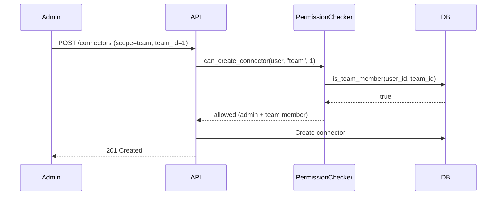
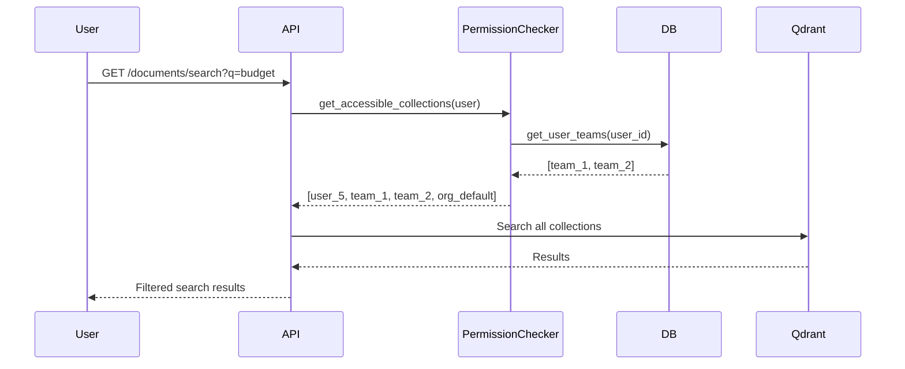

# EchoMind RBAC (Role-Based Access Control)

This document defines the permission model for EchoMind, covering user roles, resource scopes, and access rules.

---

## Roles (Authentik Groups)

EchoMind uses Authentik groups for role-based access control. Users belong to one primary group that determines their permission level. Higher-level groups inherit all permissions from lower levels.

| Group | Level | Description |
|-------|-------|-------------|
| `echomind-allowed` | Base | Standard users with access to personal resources |
| `echomind-admins` | Admin | Team managers who can create teams and manage shared resources |
| `echomind-superadmins` | Super | System administrators with full access to all resources |

### Role Hierarchy

```
echomind-superadmins
        |
        v
 echomind-admins
        |
        v
echomind-allowed
```

Users with higher roles automatically inherit all permissions from lower roles.

---

## Resource Scopes

Resources (connectors, documents) can have one of three scopes:

| Scope | Collection | Description |
|-------|------------|-------------|
| `user` | `user_{user_id}` | Personal resources, only visible to owner |
| `team` | `team_{team_id}` | Team resources, visible to all team members |
| `org` | `org_{org_id}` | Organization resources, visible to all users |

### Scope Rules

1. **User scope**: Only the owner can view/edit
2. **Team scope**: Any team member can view, only team leads and admins can edit
3. **Org scope**: All users can view, only superadmins can create/edit

---

## Permission Matrix

### Teams

| Action | echomind-allowed | echomind-admins | echomind-superadmins |
|--------|------------------|-----------------|----------------------|
| View own teams | Yes | Yes | Yes |
| View all teams | No | Yes | Yes |
| Create team | No | Yes | Yes |
| Edit team (if lead) | Yes | Yes | Yes |
| Delete team (if lead) | No | Yes | Yes |
| Add/remove members | If lead | Yes | Yes |
| Change member roles | If lead | Yes | Yes |

### Connectors

| Action | echomind-allowed | echomind-admins | echomind-superadmins |
|--------|------------------|-----------------|----------------------|
| View own connectors | Yes | Yes | Yes |
| View team connectors | If member | If member | Yes |
| View org connectors | Yes | Yes | Yes |
| Create user connector | Yes | Yes | Yes |
| Create team connector | No | Yes (if team member) | Yes |
| Create org connector | No | No | Yes |
| Edit own connector | Yes | Yes | Yes |
| Edit team connector | If lead | Yes (if member) | Yes |
| Edit org connector | No | No | Yes |
| Delete own connector | Yes | Yes | Yes |
| Delete team connector | If lead | Yes (if member) | Yes |
| Delete org connector | No | No | Yes |
| Trigger sync | If can edit | If can edit | Yes |

### Documents

Documents inherit permissions from their parent connector. Users can access documents if they can access the connector.

| Action | echomind-allowed | echomind-admins | echomind-superadmins |
|--------|------------------|-----------------|----------------------|
| View documents | If can view connector | If can view connector | Yes |
| Upload documents | If can edit connector | If can edit connector | Yes |
| Delete documents | If can edit connector | If can edit connector | Yes |
| Search documents | Across accessible connectors | Across accessible connectors | All |

### Chat & Assistants

| Action | echomind-allowed | echomind-admins | echomind-superadmins |
|--------|------------------|-----------------|----------------------|
| Create chat sessions | Yes | Yes | Yes |
| View own sessions | Yes | Yes | Yes |
| View all sessions | No | No | Yes |
| Use any assistant | Yes | Yes | Yes |
| Create assistant | No | No | Yes |
| Edit assistant | No | No | Yes |
| Delete assistant | No | No | Yes |

### Users

| Action | echomind-allowed | echomind-admins | echomind-superadmins |
|--------|------------------|-----------------|----------------------|
| View own profile | Yes | Yes | Yes |
| Edit own profile | Yes | Yes | Yes |
| View all users | No | Yes | Yes |
| Edit any user | No | No | Yes |
| Deactivate user | No | No | Yes |

### LLMs & Embedding Models

| Action | echomind-allowed | echomind-admins | echomind-superadmins |
|--------|------------------|-----------------|----------------------|
| View active models | Yes | Yes | Yes |
| View all models | No | No | Yes |
| Create model | No | No | Yes |
| Edit model | No | No | Yes |
| Delete model | No | No | Yes |
| Set default model | No | No | Yes |

---

## API Enforcement

### Backend Implementation

Permissions are enforced in three layers:

1. **Route Layer** (`src/api/routes/*.py`)
   - Role-based access using FastAPI dependencies
   - Example: `Depends(require_role("admin"))`

2. **Service Layer** (`src/api/logic/*_service.py`)
   - Business logic permission checks
   - Example: Check team membership before allowing access

3. **Query Layer** (`src/api/logic/permissions.py`)
   - Filter queries based on user access
   - Example: Filter connectors by accessible teams

### Permission Helper

```python
from api.logic.permissions import PermissionChecker

# In service layer
checker = PermissionChecker(db)

# Check if user can view a connector
if not await checker.can_view_connector(user, connector):
    raise ForbiddenError("Cannot view this connector")

# Get accessible connectors for user
connectors = await checker.get_accessible_connectors(user)

# Get document filters for search
filters = await checker.get_document_filters(user)
```

### Frontend Implementation

```typescript
import { usePermissions } from '@/auth/usePermissions'

function ConnectorPage() {
  const { can, isAdmin, canAccessTeam } = usePermissions()

  return (
    <div>
      {can('connectors:create:team') && <CreateTeamConnectorButton />}
      {can('connectors:create:org') && <CreateOrgConnectorButton />}
      {isAdmin && <AdminPanel />}
    </div>
  )
}
```

---

## Vector Collection Routing

Document embeddings are stored in Qdrant collections based on scope:

| Scope | Collection Name | Search Access |
|-------|-----------------|---------------|
| User | `user_{user_id}` | Owner only |
| Team | `team_{team_id}` | Team members |
| Org | `org_{org_id}` | All users |

### Search Behavior

When a user searches documents:

1. **Personal collection**: `user_{user.id}` (always searched)
2. **Team collections**: `team_{team.id}` for each team user belongs to
3. **Org collection**: `org_default` (always searched)

```python
# Search across all accessible collections
collections = [f"user_{user.id}"]
collections += [f"team_{t.id}" for t in user_teams]
collections.append("org_default")

results = await qdrant.multi_collection_search(collections, query)
```

---

## Token Claims

The JWT token from Authentik includes:

```json
{
  "sub": "user-uuid",
  "email": "user@example.com",
  "name": "User Name",
  "groups": ["echomind-allowed", "team-alpha"]
}
```

### Group Mapping

- `echomind-*` groups determine permission level
- Other groups (e.g., `team-*`) are informational only
- Team membership is managed in EchoMind database, not Authentik

---

## Security Considerations

### Principle of Least Privilege

- Users start with `echomind-allowed` (minimal permissions)
- Admins are granted only when needed for team management
- Superadmin is reserved for system administrators

### Audit Trail

All permission-sensitive actions are logged with:
- User ID
- Action performed
- Resource affected
- Timestamp
- Success/failure status

### Session Validation

- JWT tokens are validated on every request
- Token expiry is enforced (default: 1 hour)
- Revoked tokens are checked against Authentik

---

## Examples

### Creating a Team Connector (Admin)



### Searching Documents (Regular User)



---

## Migration Notes

### From GROUP to TEAM Scope

The connector scope enum was updated:
- `CONNECTOR_SCOPE_GROUP` -> `CONNECTOR_SCOPE_TEAM`

Existing connectors with `scope=group` should be migrated to `scope=team`.

### Database Changes

New tables added:
- `teams` - Team definitions
- `team_members` - Team membership with roles

New columns:
- `connectors.team_id` - Foreign key to teams table

---

## References

- [CLAUDE.md](../CLAUDE.md) - Project guidelines
- [src/api/logic/permissions.py](../src/api/logic/permissions.py) - Permission implementation
- [src/web/src/auth/usePermissions.ts](../src/web/src/auth/usePermissions.ts) - Frontend hooks
