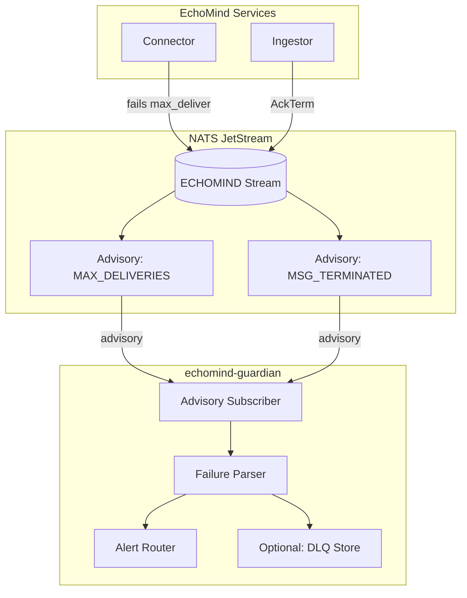
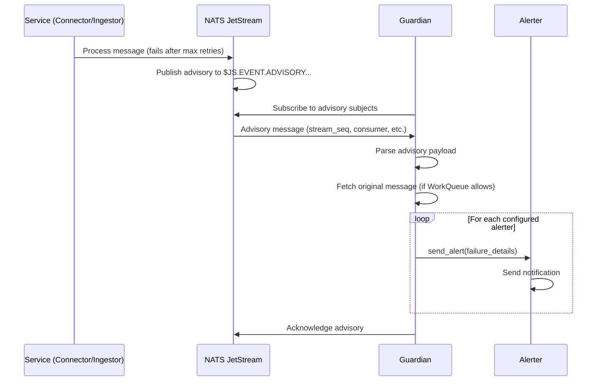
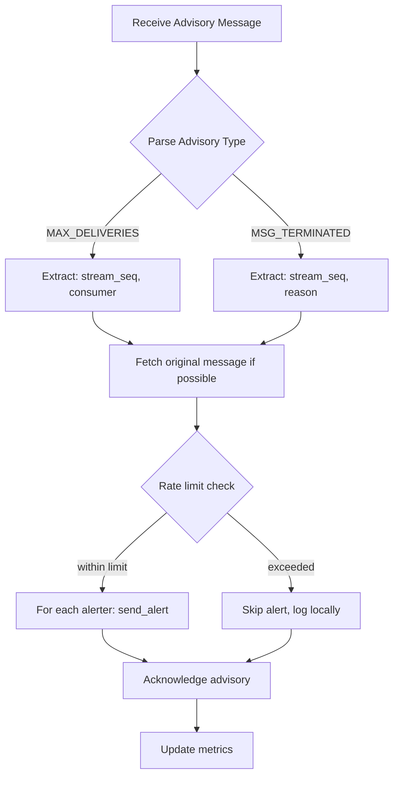

# Guardian Service

> **Service:** `echomind-guardian`
> **Protocol:** NATS (subscriber)
> **Port:** 8080 (health check only)

---

## What It Does

The Guardian Service is EchoMind's **safety net** for message processing failures:

- Monitors NATS JetStream advisory messages for failed deliveries
- Captures messages that exceeded `max_deliver` or were terminated (`AckTerm`)
- Extracts failure metadata (original subject, sequence, error reason)
- Sends alerts via configurable alerters (logging, Slack, PagerDuty, etc.)
- Optionally stores failed messages for audit/replay
- Ensures no message is silently lost

---

## How It Works

### NATS DLQ Architecture

NATS JetStream doesn't have built-in DLQ. Instead, it publishes **advisory messages** when:
1. A message reaches `max_deliver` attempts
2. A consumer calls `AckTerm` (terminal failure)

Guardian subscribes to these advisories and processes them.



### Processing Flow



### Internal Logic



---

## Technology Stack

| Component | Technology |
|-----------|------------|
| NATS Client | nats-py (async) |
| Alerting | Pluggable alerter system |
| HTTP Client | httpx (for Slack/webhooks) |
| Metrics | Prometheus client (optional) |

---

## Database Tables Used

**None required.** This service does not need PostgreSQL access.

**Optional:** For audit/replay functionality, a `dlq_messages` table could store failed messages:

| Table | Operations | Description |
|-------|------------|-------------|
| `dlq_messages` (optional) | Create | Audit log of all failed messages |

---

## Proto Definitions Used

**None.** Guardian reads NATS advisory message JSON payloads, not proto.

### Advisory Message Format

NATS publishes advisories as JSON. Example `MAX_DELIVERIES` advisory:

```json
{
  "type": "io.nats.jetstream.advisory.v1.max_deliver",
  "id": "xxx",
  "timestamp": "2026-01-28T12:00:00Z",
  "stream": "ECHOMIND",
  "consumer": "ingestor-consumer-document-process",
  "stream_seq": 12345,
  "deliveries": 5
}
```

Example `MSG_TERMINATED` advisory:

```json
{
  "type": "io.nats.jetstream.advisory.v1.terminated",
  "id": "xxx",
  "timestamp": "2026-01-28T12:00:00Z",
  "stream": "ECHOMIND",
  "consumer": "connector-consumer-google-drive",
  "stream_seq": 67890,
  "reason": "Processing timeout exceeded"
}
```

---

## NATS Messaging

### Advisory Subjects (Incoming)

| Subject Pattern | Description |
|-----------------|-------------|
| `$JS.EVENT.ADVISORY.CONSUMER.MAX_DELIVERIES.ECHOMIND.*` | Message exceeded max_deliver |
| `$JS.EVENT.ADVISORY.CONSUMER.MSG_TERMINATED.ECHOMIND.*` | Consumer called AckTerm |

### Stream Configuration

Guardian subscribes to advisory subjects. **Orchestrator creates this stream on startup** (same pattern as ECHOMIND):

```python
# In orchestrator/main.py - create DLQ advisory stream
await publisher.create_stream(
    name="ECHOMIND_DLQ",
    subjects=[
        "$JS.EVENT.ADVISORY.CONSUMER.MAX_DELIVERIES.ECHOMIND.>",
        "$JS.EVENT.ADVISORY.CONSUMER.MSG_TERMINATED.ECHOMIND.>",
    ],
)
```

### Consumer Configuration

```python
await subscriber.subscribe(
    stream="ECHOMIND_DLQ",
    consumer="guardian-advisory",
    subject="$JS.EVENT.ADVISORY.CONSUMER.*.ECHOMIND.>",
    handler=self._handle_advisory,
)
```

### Publications (Outgoing)

**None.** This service only consumes advisories and sends external alerts.

---

## Alerter System

### Available Alerters

| Alerter | Description | Config Required |
|---------|-------------|-----------------|
| `LoggingAlerter` | Logs to stdout at CRITICAL level | None (default) |
| `SlackAlerter` | Posts to Slack channel | `GUARDIAN_SLACK_WEBHOOK_URL` |
| `PagerDutyAlerter` | Creates PagerDuty incident | `GUARDIAN_PAGERDUTY_*` |
| `WebhookAlerter` | Generic HTTP POST | `GUARDIAN_WEBHOOK_URL` |

### Alert Rate Limiting

To prevent alert storms during cascading failures:

| Setting | Default | Description |
|---------|---------|-------------|
| `alert_rate_limit_per_subject` | 5 | Max alerts per subject per window |
| `alert_rate_limit_window_seconds` | 60 | Rate limit window |

### FailureDetails Model

```python
from dataclasses import dataclass
from datetime import datetime

@dataclass
class FailureDetails:
    """Details about a failed message from advisory."""

    advisory_type: str  # "max_deliveries" | "terminated"
    stream: str
    consumer: str
    stream_seq: int
    deliveries: int | None  # For max_deliveries
    reason: str | None  # For terminated
    timestamp: datetime
    original_subject: str | None  # Extracted from consumer name
    original_payload: bytes | None  # If fetchable
```

### Alerter Interface

```python
from abc import ABC, abstractmethod

class Alerter(ABC):
    """Base class for alerters."""

    @abstractmethod
    async def send_alert(self, details: FailureDetails) -> None:
        """
        Send an alert about a failed message.

        Args:
            details: Failure details from advisory.

        Raises:
            AlerterError: If alert delivery fails.
        """
        pass


class LoggingAlerter(Alerter):
    """Logs failures at CRITICAL level."""

    async def send_alert(self, details: FailureDetails) -> None:
        """
        Log failure details.

        Args:
            details: Failure details from advisory.
        """
        logger.critical(
            "💀 DLQ: %s | stream=%s consumer=%s seq=%d deliveries=%s reason=%s",
            details.advisory_type,
            details.stream,
            details.consumer,
            details.stream_seq,
            details.deliveries,
            details.reason,
        )


class SlackAlerter(Alerter):
    """Posts failures to Slack."""

    def __init__(self, webhook_url: str, channel: str | None = None) -> None:
        """
        Initialize Slack alerter.

        Args:
            webhook_url: Slack incoming webhook URL.
            channel: Optional channel override.
        """
        self.webhook_url = webhook_url
        self.channel = channel

    async def send_alert(self, details: FailureDetails) -> None:
        """
        Send alert to Slack.

        Args:
            details: Failure details from advisory.

        Raises:
            AlerterError: If Slack API call fails.
        """
        import httpx

        payload = {
            "text": f":rotating_light: *DLQ Alert*: Message failed in `{details.stream}`",
            "attachments": [{
                "color": "danger",
                "fields": [
                    {"title": "Consumer", "value": details.consumer, "short": True},
                    {"title": "Sequence", "value": str(details.stream_seq), "short": True},
                    {"title": "Deliveries", "value": str(details.deliveries or "N/A"), "short": True},
                    {"title": "Type", "value": details.advisory_type, "short": True},
                    {"title": "Reason", "value": details.reason or "Max deliveries exceeded"},
                ]
            }]
        }
        if self.channel:
            payload["channel"] = self.channel

        async with httpx.AsyncClient() as client:
            response = await client.post(self.webhook_url, json=payload, timeout=10.0)
            response.raise_for_status()
```

---

## Service Structure

```
src/guardian/
├── __init__.py
├── main.py                     # Entry point with graceful degradation
├── config.py                   # GuardianSettings (Pydantic)
├── Dockerfile
├── requirements.txt
│
├── logic/
│   ├── __init__.py
│   ├── exceptions.py           # Domain exceptions
│   ├── guardian_service.py     # Main service class
│   ├── advisory_parser.py      # Parse NATS advisory JSON
│   └── rate_limiter.py         # Alert rate limiting
│
├── alerters/
│   ├── __init__.py
│   ├── base.py                 # Alerter ABC
│   ├── logging_alerter.py      # LoggingAlerter
│   ├── slack_alerter.py        # SlackAlerter
│   ├── pagerduty_alerter.py    # PagerDutyAlerter
│   └── webhook_alerter.py      # WebhookAlerter
│
└── middleware/
    └── error_handler.py
```

---

## Configuration

### GuardianSettings Class

```python
from pydantic import Field
from pydantic_settings import BaseSettings, SettingsConfigDict


class GuardianSettings(BaseSettings):
    """Settings for the Guardian service."""

    # Service Settings
    enabled: bool = Field(True, description="Enable guardian service")
    health_port: int = Field(8080, description="Health check HTTP port")

    # NATS
    nats_url: str = Field(
        "nats://localhost:4222",
        description="NATS server URL",
    )
    nats_user: str | None = Field(None, description="NATS username")
    nats_password: str | None = Field(None, description="NATS password")
    nats_stream_name: str = Field(
        "ECHOMIND_DLQ",
        description="NATS stream for DLQ advisories",
    )
    nats_consumer_name: str = Field(
        "guardian-advisory",
        description="NATS consumer durable name",
    )

    # Alerters (comma-separated list)
    alerters: str = Field(
        "logging",
        description="Comma-separated alerter names: logging,slack,pagerduty,webhook",
    )

    # Rate Limiting
    alert_rate_limit_per_subject: int = Field(
        5,
        description="Max alerts per original subject per window",
        ge=1,
    )
    alert_rate_limit_window_seconds: int = Field(
        60,
        description="Rate limit window in seconds",
        ge=1,
    )

    # Slack Alerter
    slack_webhook_url: str | None = Field(
        None,
        description="Slack incoming webhook URL",
    )
    slack_channel: str | None = Field(
        None,
        description="Slack channel override",
    )

    # PagerDuty Alerter
    pagerduty_api_key: str | None = Field(
        None,
        description="PagerDuty API key",
    )
    pagerduty_service_id: str | None = Field(
        None,
        description="PagerDuty service ID",
    )
    pagerduty_severity: str = Field(
        "error",
        description="PagerDuty severity: critical, error, warning, info",
    )

    # Webhook Alerter
    webhook_url: str | None = Field(
        None,
        description="Generic webhook URL",
    )
    webhook_secret: str | None = Field(
        None,
        description="Webhook HMAC secret for signing",
    )

    # Logging
    log_level: str = Field("INFO", description="Logging level")

    model_config = SettingsConfigDict(
        env_prefix="GUARDIAN_",
        env_file=".env",
        extra="ignore",
    )
```

### Environment Variables

```bash
# config/guardian/guardian.env

# Service
GUARDIAN_ENABLED=true
GUARDIAN_HEALTH_PORT=8080
GUARDIAN_LOG_LEVEL=INFO

# NATS
GUARDIAN_NATS_URL=nats://nats:4222
GUARDIAN_NATS_STREAM_NAME=ECHOMIND_DLQ
GUARDIAN_NATS_CONSUMER_NAME=guardian-advisory

# Alerters (comma-separated)
GUARDIAN_ALERTERS=logging,slack

# Rate Limiting
GUARDIAN_ALERT_RATE_LIMIT_PER_SUBJECT=5
GUARDIAN_ALERT_RATE_LIMIT_WINDOW_SECONDS=60

# Slack (if enabled)
GUARDIAN_SLACK_WEBHOOK_URL=https://hooks.slack.com/services/xxx/yyy/zzz
GUARDIAN_SLACK_CHANNEL=#echomind-alerts

# PagerDuty (if enabled)
# GUARDIAN_PAGERDUTY_API_KEY=xxx
# GUARDIAN_PAGERDUTY_SERVICE_ID=yyy
# GUARDIAN_PAGERDUTY_SEVERITY=error

# Webhook (if enabled)
# GUARDIAN_WEBHOOK_URL=https://example.com/webhook
# GUARDIAN_WEBHOOK_SECRET=xxx
```

---

## Main Entry Point

Following the **graceful degradation pattern** (same as Connector/Ingestor):

```python
# src/guardian/main.py

class GuardianApp:
    """
    Main Guardian application.

    Uses graceful degradation - starts health server first,
    retries failed connections in background.
    """

    def __init__(self) -> None:
        self._settings = get_settings()
        self._subscriber: JetStreamSubscriber | None = None
        self._health_server: HealthServer | None = None
        self._running = False
        self._retry_tasks: list[asyncio.Task[None]] = []
        self._nats_connected = False

    async def start(self) -> None:
        """Start the Guardian service with graceful degradation."""
        logger.info("🛡️ Starting EchoMind Guardian Service...")

        if not self._settings.enabled:
            logger.warning("⚠️ Guardian is disabled via configuration")
            return

        # Start health server FIRST
        self._health_server = HealthServer(port=self._settings.health_port)
        health_thread = threading.Thread(
            target=self._health_server.start,
            daemon=True,
        )
        health_thread.start()
        logger.info("💓 Health server started on port %d", self._settings.health_port)

        # Initialize NATS with graceful degradation
        logger.info("🔌 Connecting to NATS...")
        try:
            self._subscriber = await init_nats_subscriber(
                servers=[self._settings.nats_url],
                user=self._settings.nats_user,
                password=self._settings.nats_password,
            )
            self._nats_connected = True
            logger.info("✅ NATS connected")
            await self._setup_subscriptions()
        except Exception as e:
            logger.warning("⚠️ NATS connection failed: %s", e)
            logger.info("🔄 Will retry NATS connection in background...")
            self._retry_tasks.append(
                asyncio.create_task(self._retry_nats_connection())
            )

        self._update_readiness()
        self._running = True

        if self._is_ready():
            logger.info("✅ Guardian ready and listening for advisories")
        else:
            logger.warning("⚠️ Guardian started but waiting for connections...")

    async def _handle_advisory(self, msg: Msg) -> None:
        """Handle incoming NATS advisory message."""
        if not self._is_ready():
            await msg.nak()
            return

        try:
            # Parse advisory JSON
            details = AdvisoryParser.parse(msg.data)

            # Rate limit check
            if not self._rate_limiter.allow(details.original_subject):
                logger.warning(
                    "🚫 Rate limited alert for subject: %s",
                    details.original_subject,
                )
                await msg.ack()
                return

            # Send to all configured alerters
            for alerter in self._alerters:
                try:
                    await alerter.send_alert(details)
                except Exception as e:
                    logger.error("❌ Alerter %s failed: %s", type(alerter).__name__, e)

            await msg.ack()
            logger.info("✅ Processed advisory for seq %d", details.stream_seq)

        except Exception as e:
            logger.exception("❌ Advisory processing failed: %s", e)
            await msg.nak()
```

---

## Dockerfile

```dockerfile
# src/guardian/Dockerfile
FROM python:3.12-slim

WORKDIR /app

# Install dependencies
COPY requirements.txt .
RUN pip install --no-cache-dir -r requirements.txt

# Copy shared library
COPY echomind_lib/ /app/echomind_lib/

# Copy service code
COPY guardian/ /app/guardian/

# Health check
HEALTHCHECK --interval=30s --timeout=3s --start-period=5s --retries=3 \
    CMD python -c "import urllib.request; urllib.request.urlopen('http://localhost:8080/healthz')" || exit 1

# Run service
CMD ["python", "-m", "guardian.main"]
```

### requirements.txt

```
# src/guardian/requirements.txt
nats-py>=2.6.0
httpx>=0.27.0
pydantic>=2.5.0
pydantic-settings>=2.1.0

# Shared library
-e ../echomind_lib
```

---

## Docker Compose Integration

```yaml
# deployment/docker-cluster/docker-compose.yml

guardian:
  image: ${DOCKER_REGISTRY}/${DOCKER_IMAGE_PREFIX}-guardian:${GUARDIAN_VERSION:-${ECHOMIND_VERSION}}
  container_name: echomind-guardian
  build:
    context: ../../src
    dockerfile: guardian/Dockerfile
  env_file:
    - ../../config/guardian/guardian.env
  environment:
    - GUARDIAN_NATS_URL=nats://nats:4222
  depends_on:
    nats:
      condition: service_healthy
    orchestrator:
      condition: service_healthy  # Creates ECHOMIND_DLQ stream
  networks:
    - backend
  healthcheck:
    test: ["CMD", "python", "-c", "import urllib.request; urllib.request.urlopen('http://localhost:8080/healthz')"]
    interval: 30s
    timeout: 3s
    retries: 3
    start_period: 10s
  restart: unless-stopped
```

---

## Orchestrator Changes Required

Orchestrator must create the DLQ advisory stream:

```python
# In orchestrator/main.py - add after ECHOMIND stream creation

# Create DLQ advisory stream for Guardian
try:
    await publisher.create_stream(
        name="ECHOMIND_DLQ",
        subjects=[
            "$JS.EVENT.ADVISORY.CONSUMER.MAX_DELIVERIES.ECHOMIND.>",
            "$JS.EVENT.ADVISORY.CONSUMER.MSG_TERMINATED.ECHOMIND.>",
        ],
    )
    logger.info("✅ NATS DLQ stream 'ECHOMIND_DLQ' ready")
except Exception as e:
    if "already in use" not in str(e).lower():
        logger.warning("⚠️ DLQ stream creation warning: %s", e)
```

---

## Metrics (Optional)

| Metric | Type | Description |
|--------|------|-------------|
| `guardian_advisories_total` | Counter | Total advisory messages received |
| `guardian_advisories_by_consumer` | Counter | Advisories by consumer name |
| `guardian_alerts_sent_total` | Counter | Total alerts sent |
| `guardian_alerts_failed_total` | Counter | Failed alert attempts |
| `guardian_rate_limited_total` | Counter | Alerts skipped due to rate limiting |

---

## Health Check

Uses `HealthServer` from `echomind_lib` (same as other NATS services):

```bash
GET :8080/healthz

# Response when ready
{"status": "healthy"}

# Response when not ready (NATS disconnected)
{"status": "unhealthy"}
```

---

## Error Handling

| Error | Handling |
|-------|----------|
| Alerter failure | Log error, continue with other alerters, don't fail message |
| NATS disconnection | Background retry task, mark as not ready |
| Invalid advisory JSON | Log warning, acknowledge anyway (don't reprocess) |
| Rate limit exceeded | Log warning, acknowledge, skip alerters |

---

## Unit Testing (MANDATORY)

All service logic MUST have unit tests. See [Testing Standards](../../.claude/rules/testing.md).

### Test Location

```
tests/unit/guardian/
├── __init__.py
├── test_config.py
├── test_exceptions.py
├── test_guardian_service.py
├── test_advisory_parser.py
├── test_rate_limiter.py
└── test_alerters/
    ├── __init__.py
    ├── test_logging_alerter.py
    ├── test_slack_alerter.py
    └── test_webhook_alerter.py
```

### What to Test

| Component | Test Coverage |
|-----------|---------------|
| GuardianSettings | Default values, env prefix, validation |
| AdvisoryParser | JSON parsing, both advisory types, edge cases |
| RateLimiter | Window expiry, per-subject limits |
| GuardianService | Advisory handling, alerter routing |
| LoggingAlerter | Log format, levels |
| SlackAlerter | Payload format, HTTP errors |
| WebhookAlerter | Request format, HMAC signing |

### Example Tests

```python
# tests/unit/guardian/test_advisory_parser.py
import pytest
from guardian.logic.advisory_parser import AdvisoryParser

class TestAdvisoryParser:
    def test_parses_max_deliveries_advisory(self):
        """Parse MAX_DELIVERIES advisory JSON."""
        data = b'''{
            "type": "io.nats.jetstream.advisory.v1.max_deliver",
            "stream": "ECHOMIND",
            "consumer": "ingestor-consumer-document-process",
            "stream_seq": 12345,
            "deliveries": 5
        }'''

        details = AdvisoryParser.parse(data)

        assert details.advisory_type == "max_deliveries"
        assert details.stream == "ECHOMIND"
        assert details.consumer == "ingestor-consumer-document-process"
        assert details.stream_seq == 12345
        assert details.deliveries == 5

    def test_parses_terminated_advisory(self):
        """Parse MSG_TERMINATED advisory JSON."""
        data = b'''{
            "type": "io.nats.jetstream.advisory.v1.terminated",
            "stream": "ECHOMIND",
            "consumer": "connector-google-drive",
            "stream_seq": 67890,
            "reason": "Processing timeout"
        }'''

        details = AdvisoryParser.parse(data)

        assert details.advisory_type == "terminated"
        assert details.reason == "Processing timeout"

    def test_handles_missing_fields(self):
        """Handle advisory with minimal fields."""
        data = b'{"type": "unknown", "stream": "TEST"}'

        details = AdvisoryParser.parse(data)

        assert details.stream == "TEST"
        assert details.deliveries is None
        assert details.reason is None


# tests/unit/guardian/test_rate_limiter.py
import pytest
import time
from guardian.logic.rate_limiter import RateLimiter

class TestRateLimiter:
    def test_allows_within_limit(self):
        """Allow alerts within rate limit."""
        limiter = RateLimiter(max_per_subject=3, window_seconds=60)

        assert limiter.allow("document.process") is True
        assert limiter.allow("document.process") is True
        assert limiter.allow("document.process") is True

    def test_blocks_over_limit(self):
        """Block alerts over rate limit."""
        limiter = RateLimiter(max_per_subject=2, window_seconds=60)

        assert limiter.allow("document.process") is True
        assert limiter.allow("document.process") is True
        assert limiter.allow("document.process") is False

    def test_separate_limits_per_subject(self):
        """Each subject has independent limit."""
        limiter = RateLimiter(max_per_subject=1, window_seconds=60)

        assert limiter.allow("subject.a") is True
        assert limiter.allow("subject.b") is True
        assert limiter.allow("subject.a") is False


# tests/unit/guardian/test_alerters/test_slack_alerter.py
import pytest
from unittest.mock import AsyncMock, patch, MagicMock
from datetime import datetime
from guardian.alerters.slack_alerter import SlackAlerter
from guardian.logic.advisory_parser import FailureDetails

class TestSlackAlerter:
    @pytest.fixture
    def alerter(self):
        return SlackAlerter(webhook_url="https://hooks.slack.com/test")

    @pytest.fixture
    def failure_details(self):
        return FailureDetails(
            advisory_type="max_deliveries",
            stream="ECHOMIND",
            consumer="ingestor-consumer",
            stream_seq=123,
            deliveries=5,
            reason=None,
            timestamp=datetime.now(),
            original_subject="document.process",
            original_payload=None,
        )

    @pytest.mark.asyncio
    async def test_sends_alert_to_slack(self, alerter, failure_details):
        """Send formatted alert to Slack webhook."""
        with patch("httpx.AsyncClient") as mock_client:
            mock_response = MagicMock()
            mock_response.raise_for_status = MagicMock()
            mock_client.return_value.__aenter__.return_value.post = AsyncMock(
                return_value=mock_response
            )

            await alerter.send_alert(failure_details)

            mock_client.return_value.__aenter__.return_value.post.assert_called_once()

    @pytest.mark.asyncio
    async def test_includes_failure_details_in_payload(self, alerter, failure_details):
        """Payload includes all failure details."""
        with patch("httpx.AsyncClient") as mock_client:
            mock_response = MagicMock()
            mock_response.raise_for_status = MagicMock()
            mock_post = AsyncMock(return_value=mock_response)
            mock_client.return_value.__aenter__.return_value.post = mock_post

            await alerter.send_alert(failure_details)

            call_args = mock_post.call_args
            payload = call_args.kwargs["json"]
            assert "ECHOMIND" in payload["text"]
            assert any("ingestor-consumer" in str(f) for f in payload["attachments"][0]["fields"])
```

### Minimum Coverage

- **70%** for service classes
- **80%** for alerter implementations
- **80%** for parser/rate limiter utilities

---

## References

- [NATS JetStream Consumers](https://docs.nats.io/using-nats/developer/develop_jetstream/consumers) - Advisory message docs
- [NATS DLQ Pattern](https://dev.to/antonmihaylov/implementing-a-retry-and-dlq-strategy-in-nats-jetstream-4k2k) - Implementation guide
- [Architecture](../architecture.md) - System overview
- [NATS Messaging](../nats-messaging.md) - Message flow documentation
- [Orchestrator Service](./orchestrator-service.md) - Creates DLQ stream
- [Ingestor Service](./ingestor-service.md) - Document processing (source of failures)
- [Connector Service](./connector-service.md) - Cloud sync (source of failures)

---

## Sources

- [Consumer Details | NATS Docs](https://docs.nats.io/using-nats/developer/develop_jetstream/consumers)
- [Implementing a Retry and DLQ Strategy in NATS JetStream - DEV Community](https://dev.to/antonmihaylov/implementing-a-retry-and-dlq-strategy-in-nats-jetstream-4k2k)
- [NATS Dead Letter Queue | lol-IoT](https://wiki.loliot.net/docs/mlops/mlops/event/nats/dlq)
