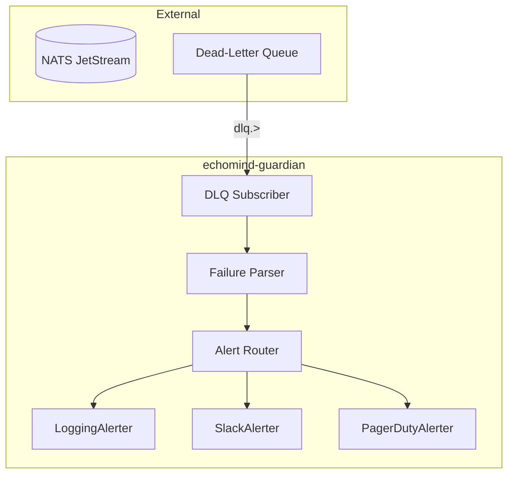
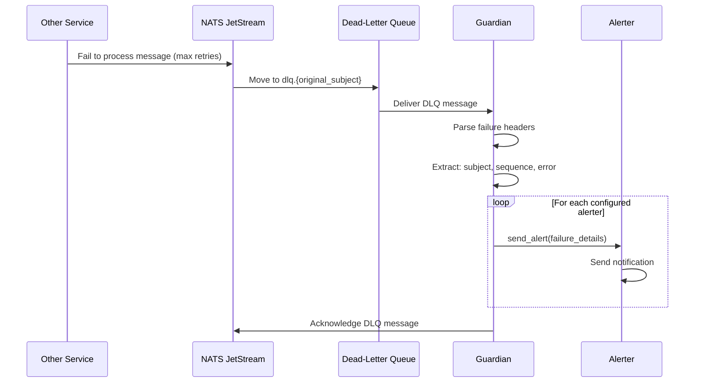
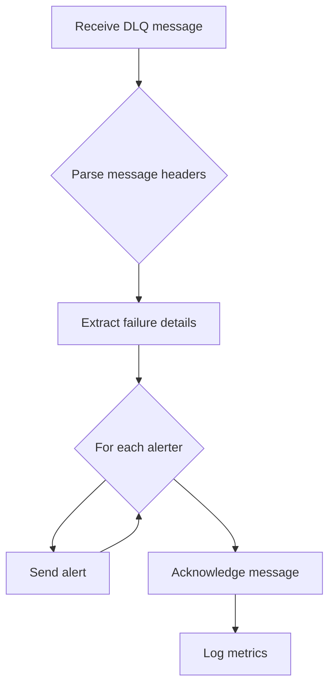

# Guardian Service

> **Service:** `echomind-guardian`
> **Protocol:** NATS (subscriber)
> **Port:** 8080 (health check only)

---

## What It Does

The Guardian Service is EchoMind's **safety net** for message processing failures:

- Monitors the NATS Dead-Letter Queue (DLQ) for failed messages
- Extracts failure metadata (original subject, sequence, error reason)
- Sends alerts via configurable alerters (logging, Slack, PagerDuty, etc.)
- Ensures no message is silently lost
- Provides observability into pipeline failures

---

## How It Works

### Architecture



### Processing Flow



### Internal Logic



---

## Technology Stack

| Component | Technology |
|-----------|------------|
| NATS Client | nats-py (async) |
| Alerting | Pluggable alerter system |
| Metrics | Prometheus client |

---

## Database Tables Used

**None.** This service does not access PostgreSQL directly.

Optionally, it may write to a `dlq_failures` table for audit/reporting:

| Table | Operations | Description |
|-------|------------|-------------|
| `dlq_failures` (optional) | Create | Audit log of all DLQ messages |

---

## Proto Definitions Used

**None.** The Guardian reads raw NATS message headers, not proto payloads.

---

## NATS Messaging

### Subscriptions (Incoming)

| Subject | Payload | From |
|---------|---------|------|
| `dlq.>` | Failed message + headers | NATS DLQ |

### Publications (Outgoing)

**None.** This service only consumes and acknowledges.

### DLQ Message Headers

When a message fails max retries, NATS adds these headers:

| Header | Description |
|--------|-------------|
| `Nats-Original-Subject` | Original subject (e.g., `document.process`) |
| `Nats-Original-Stream` | Original stream name |
| `Nats-Original-Sequence` | Sequence number in original stream |
| `Nats-Failure-Description` | Error description |
| `Nats-Num-Delivered` | Number of delivery attempts |

### Consumer Configuration

```python
subscriber = JetStreamEventSubscriber(
    nats_url="nats://nats:4222",
    stream_name="ECHOMIND_DLQ",
    subjects=["dlq.>"],
    durable_name="guardian-consumer",
    queue_group="guardian-workers"
)
```

---

## Alerter System

### Available Alerters

| Alerter | Description | Config |
|---------|-------------|--------|
| `LoggingAlerter` | Logs to stdout/stderr at CRITICAL level | Default |
| `SlackAlerter` | Posts to Slack channel | `SLACK_WEBHOOK_URL` |
| `PagerDutyAlerter` | Creates PagerDuty incident | `PAGERDUTY_API_KEY` |
| `EmailAlerter` | Sends email notification | `SMTP_*` config |
| `WebhookAlerter` | Generic HTTP webhook | `WEBHOOK_URL` |

### Alerter Interface

```python
from abc import ABC, abstractmethod
from dataclasses import dataclass

@dataclass
class FailureDetails:
    """Details about a failed message."""
    original_subject: str
    original_stream: str
    original_sequence: int
    failure_description: str
    num_delivered: int
    timestamp: datetime
    raw_payload: bytes

class Alerter(ABC):
    """Base class for alerters."""

    @abstractmethod
    async def send_alert(self, details: FailureDetails) -> None:
        """Send an alert about a failed message."""
        pass

class LoggingAlerter(Alerter):
    """Logs failures at CRITICAL level."""

    async def send_alert(self, details: FailureDetails) -> None:
        logger.critical(
            "💀 DLQ Message Failed | subject=%s stream=%s seq=%d attempts=%d error=%s",
            details.original_subject,
            details.original_stream,
            details.original_sequence,
            details.num_delivered,
            details.failure_description,
        )

class SlackAlerter(Alerter):
    """Posts failures to Slack."""

    def __init__(self, webhook_url: str):
        self.webhook_url = webhook_url

    async def send_alert(self, details: FailureDetails) -> None:
        async with httpx.AsyncClient() as client:
            await client.post(self.webhook_url, json={
                "text": f"🚨 *DLQ Alert*: Message failed on `{details.original_subject}`",
                "attachments": [{
                    "color": "danger",
                    "fields": [
                        {"title": "Stream", "value": details.original_stream, "short": True},
                        {"title": "Sequence", "value": str(details.original_sequence), "short": True},
                        {"title": "Attempts", "value": str(details.num_delivered), "short": True},
                        {"title": "Error", "value": details.failure_description},
                    ]
                }]
            })
```

---

## Service Structure

```
src/services/guardian/
├── main.py                 # Entry point
├── nats/
│   └── subscriber.py       # DLQ subscriber
├── logic/
│   ├── guardian_service.py # Core logic
│   ├── failure_parser.py   # Parse DLQ headers
│   └── exceptions.py
├── alerters/
│   ├── __init__.py
│   ├── base.py             # Alerter ABC
│   ├── logging.py          # LoggingAlerter
│   ├── slack.py            # SlackAlerter
│   ├── pagerduty.py        # PagerDutyAlerter
│   └── webhook.py          # WebhookAlerter
├── middleware/
│   └── error_handler.py
└── config.py
```

---

## Configuration

```bash
# NATS
NATS_URL=nats://nats:4222
NATS_DLQ_STREAM=ECHOMIND_DLQ

# Alerters (comma-separated)
GUARDIAN_ALERTERS=logging,slack

# Slack (if enabled)
SLACK_WEBHOOK_URL=https://hooks.slack.com/services/xxx/yyy/zzz
SLACK_CHANNEL=#echomind-alerts

# PagerDuty (if enabled)
PAGERDUTY_API_KEY=xxx
PAGERDUTY_SERVICE_ID=yyy

# Email (if enabled)
SMTP_HOST=smtp.example.com
SMTP_PORT=587
SMTP_USER=alerts@example.com
SMTP_PASSWORD=xxx
ALERT_EMAIL_TO=ops@example.com

# Webhook (if enabled)
WEBHOOK_URL=https://example.com/webhook
WEBHOOK_SECRET=xxx
```

---

## DLQ Stream Configuration

```bash
# Create DLQ stream
nats stream add ECHOMIND_DLQ \
  --subjects "dlq.>" \
  --retention limits \
  --max-age 30d \
  --storage file \
  --replicas 1
```

| Setting | Value | Rationale |
|---------|-------|-----------|
| Retention | limits | Keep for audit/debugging |
| Max Age | 30 days | Long retention for investigation |
| Storage | file | Persist across restarts |

---

## Metrics

| Metric | Type | Description |
|--------|------|-------------|
| `guardian_dlq_messages_total` | Counter | Total DLQ messages received |
| `guardian_dlq_messages_by_subject` | Counter | DLQ messages by original subject |
| `guardian_alerts_sent_total` | Counter | Total alerts sent |
| `guardian_alerts_failed_total` | Counter | Failed alert attempts |

---

## Health Check

```bash
GET :8080/healthz

# Response
{
  "status": "healthy",
  "nats": "connected",
  "dlq_stream": "ECHOMIND_DLQ",
  "alerters": ["logging", "slack"],
  "messages_processed": 42
}
```

---

## Error Handling

| Error | Handling |
|-------|----------|
| Alerter failure | Log error, continue with other alerters |
| NATS disconnection | Reconnect with backoff |
| Invalid DLQ message | Log warning, acknowledge anyway |

---

## Unit Testing (MANDATORY)

All service logic MUST have unit tests. See [Testing Standards](../../.claude/rules/testing.md).

### Test Location

```
tests/unit/guardian/
├── test_guardian_service.py
├── test_failure_parser.py
└── test_alerters/
    ├── test_logging_alerter.py
    ├── test_slack_alerter.py
    └── test_webhook_alerter.py
```

### What to Test

| Component | Test Coverage |
|-----------|---------------|
| GuardianService | Message handling, alerter routing |
| FailureParser | Header extraction, edge cases |
| LoggingAlerter | Log format, levels |
| SlackAlerter | Payload format, error handling |
| WebhookAlerter | Request format, retries |

### Example

```python
# tests/unit/guardian/test_failure_parser.py
class TestFailureParser:
    def test_parses_dlq_headers(self):
        headers = {
            "Nats-Original-Subject": "document.process",
            "Nats-Original-Stream": "ECHOMIND",
            "Nats-Original-Sequence": "123",
            "Nats-Failure-Description": "Processing timeout",
            "Nats-Num-Delivered": "5",
        }

        details = FailureParser.parse(headers, b"payload")

        assert details.original_subject == "document.process"
        assert details.original_sequence == 123
        assert details.num_delivered == 5

    def test_handles_missing_headers(self):
        headers = {}

        details = FailureParser.parse(headers, b"payload")

        assert details.original_subject == "unknown"
        assert details.failure_description == "No failure description"

# tests/unit/guardian/test_alerters/test_slack_alerter.py
class TestSlackAlerter:
    @pytest.fixture
    def alerter(self):
        return SlackAlerter(webhook_url="https://hooks.slack.com/test")

    @pytest.mark.asyncio
    async def test_sends_alert_to_slack(self, alerter):
        details = FailureDetails(
            original_subject="document.process",
            original_stream="ECHOMIND",
            original_sequence=123,
            failure_description="Timeout",
            num_delivered=5,
            timestamp=datetime.now(),
            raw_payload=b"test",
        )

        with patch("httpx.AsyncClient.post") as mock_post:
            mock_post.return_value = MagicMock(status_code=200)
            await alerter.send_alert(details)

        mock_post.assert_called_once()
        call_args = mock_post.call_args
        assert "document.process" in str(call_args)
```

### Minimum Coverage

- **70%** for service classes
- **80%** for alerter implementations

---

## References

- [NATS Messaging](../nats-messaging.md) - Message flow documentation
- [Architecture](../architecture.md) - System overview
- [NATS JetStream DLQ](https://docs.nats.io/using-nats/developer/develop_jetstream/consumers#dead-letter-queues)
