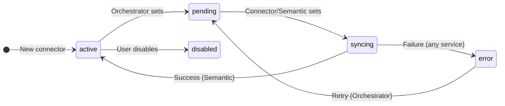
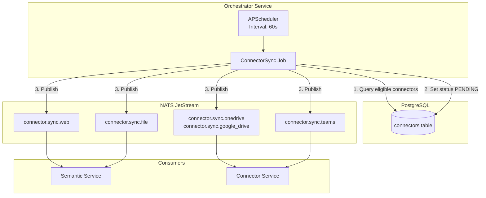
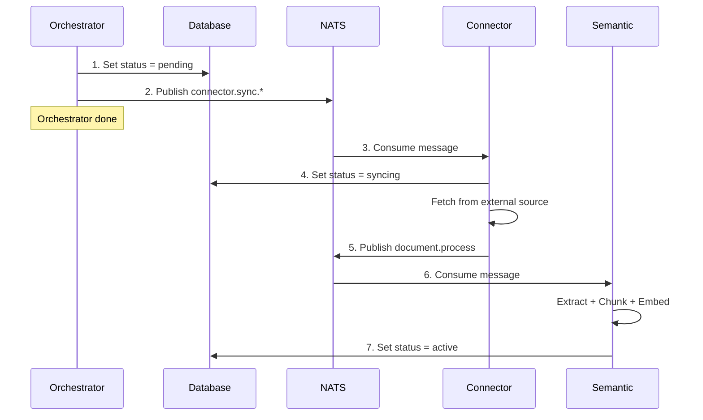

# Orchestrator Service

> **Status**: Draft
> **Technology**: APScheduler
> **Location**: `src/services/orchestrator/`

---

## Overview

The Orchestrator Service is a **lightweight trigger service** that monitors the database and sends NATS messages when work needs to be done. It does NOT execute any business logic itself.

**What it does:**
- Query the database for connectors due for sync
- Update connector status to `pending`
- Publish a message to NATS

**What it does NOT do:**
- Fetch data from external sources
- Process documents
- Update status to `syncing`, `active`, or `error` (other services do this)

---

## Responsibility Boundaries

```mermaid
flowchart LR
    subgraph Orchestrator["Orchestrator Service"]
        S1[1. Query DB]
        S2[2. Set PENDING]
        S3[3. Send NATS]
    end

    subgraph Connector["Connector Service"]
        C1[3. Pick up msg]
        C2[4. Set SYNCING]
        C3[5. Fetch data]
        C4[6. Send NATS]
    end

    subgraph Semantic["Semantic Service"]
        E1[5. Pick up msg]
        E2[6. Extract + Chunk]
        E3[7. Embed]
        E4[8. Set ACTIVE or ERROR]
    end

    Orchestrator -->|NATS| Connector
    Connector -->|NATS| Semantic
```



| Action | Responsible Service |
|--------|---------------------|
| Set status to `pending` | Orchestrator |
| Set status to `syncing` | Connector or Semantic |
| Set status to `active` | Semantic (on success) |
| Set status to `error` | Any service (on failure) |

**Status Values:** See [Proto Definitions](../proto-definitions.md#connectorstatus)

---

## Core Responsibilities

### 1. Connector Sync Check

Query the `connectors` table for rows that need sync:

| Field | Purpose |
|-------|---------|
| `status` | Trigger if `active` or `error`. Skip if `pending`, `syncing`, or `disabled` |
| `refresh_freq_minutes` | Interval between syncs (null = manual only) |
| `last_sync_at` | Calculate next run time |
| `type` | Determines NATS subject routing |

**Database Schema:** See [DB Schema - connectors](../db-schema.md#connectors)

### 2. Refresh Rules by Connector Type

| Connector Type | Default Refresh | Route To | Behavior |
|----------------|-----------------|----------|----------|
| `web` | 7 days | Semantic | Full re-crawl |
| `file` | One-time | Semantic | Manual upload, no refresh |
| `onedrive` | 7 days | Connector | Delta sync (changed files) |
| `google_drive` | 7 days | Connector | Delta sync (changed files) |
| `teams` | 1 day | Connector | Incremental (new messages) |

**Connector Types:** See [Proto Definitions](../proto-definitions.md#connectortype)

### 3. Status Flow



**Statuses that ALLOW scheduling:**
- `active` - Ready for sync (check refresh_freq_minutes + last_sync_at)
- `error` - Failed, can retry

**Statuses that BLOCK scheduling:**
- `pending` - Already queued, waiting for worker
- `syncing` - Currently processing
- `disabled` - User disabled connector

---

## Architecture



---

## Job Types

### 1. ConnectorSyncJob (Primary)

Runs every minute, checks for connectors due for sync:

```python
async def connector_sync_check() -> None:
    """
    Check for connectors that need synchronization.

    For each connector due for sync:
    1. Update status to pending
    2. Publish NATS message

    Does NOT wait for response or do any processing.
    """
    now = datetime.utcnow()

    # Find connectors eligible for sync:
    # - Status is active (ready) or error (can retry)
    # - refresh_freq_minutes is set (not manual-only)
    # - last_sync_at + refresh_freq_minutes <= now
    connectors = await db.execute(
        select(Connector)
        .where(Connector.status.in_(["active", "error"]))
        .where(Connector.refresh_freq_minutes.isnot(None))
        .where(
            or_(
                Connector.last_sync_at.is_(None),
                Connector.last_sync_at +
                    func.make_interval(mins=Connector.refresh_freq_minutes) <= now
            )
        )
    )

    for connector in connectors.scalars():
        # 1. Update status to pending
        await db.execute(
            update(Connector)
            .where(Connector.id == connector.id)
            .values(status="pending")
        )
        await db.commit()

        # 2. Generate chunking session ID
        chunking_session = str(uuid.uuid4())

        # 3. Publish NATS message (fire-and-forget)
        subject = f"connector.sync.{connector.type}"
        await nats.publish(subject, ConnectorSyncRequest(
            connector_id=connector.id,
            type=connector.type,
            user_id=connector.user_id,
            scope=connector.scope,
            scope_id=connector.scope_id,
            config=connector.config,
            state=connector.state,
            chunking_session=chunking_session,
        ))

        logger.info("📤 Triggered sync for connector %s (session: %s)",
                    connector.id, chunking_session)
```

---

## Integration with Existing Services

### Message Flow (Fire-and-Forget)

The orchestrator publishes and moves on. It does NOT wait for responses.



### NATS Subjects

| Subject | Publisher | Consumer | Payload |
|---------|-----------|----------|---------|
| `connector.sync.web` | Orchestrator | Semantic | `ConnectorSyncRequest` |
| `connector.sync.file` | Orchestrator | Semantic | `ConnectorSyncRequest` |
| `connector.sync.onedrive` | Orchestrator | Connector | `ConnectorSyncRequest` |
| `connector.sync.google_drive` | Orchestrator | Connector | `ConnectorSyncRequest` |
| `connector.sync.teams` | Orchestrator | Connector | `ConnectorSyncRequest` |
| `document.process` | Connector | Semantic | `DocumentProcessRequest` |

**Note:** The orchestrator does NOT subscribe to any subjects. It only publishes.

**Proto Messages:** See [Proto Definitions](../proto-definitions.md#connectorsyncrequest)

---

## Service Structure

```
src/services/orchestrator/
├── __init__.py
├── main.py                 # Entry point
├── logic/
│   ├── __init__.py
│   ├── orchestrator_service.py  # Core scheduling logic
│   ├── jobs/
│   │   ├── __init__.py
│   │   ├── connector_sync.py    # Connector sync job
│   │   ├── cleanup.py           # Cleanup job
│   │   └── health_check.py      # Health check job
│   └── exceptions.py            # Domain exceptions
├── middleware/
│   └── error_handler.py
└── config.py               # Service configuration
```

---

## Configuration

### Environment Variables

```bash
# Orchestrator Settings
ORCHESTRATOR_ENABLED=true
ORCHESTRATOR_CHECK_INTERVAL_SECONDS=60
ORCHESTRATOR_MAX_CONCURRENT_SYNCS=5
ORCHESTRATOR_JOB_STORE_URL=${DATABASE_URL}

# Default Refresh Intervals (minutes)
ORCHESTRATOR_DEFAULT_REFRESH_WEB=10080       # 7 days
ORCHESTRATOR_DEFAULT_REFRESH_DRIVE=10080     # 7 days
ORCHESTRATOR_DEFAULT_REFRESH_CHAT=1440       # 1 day
ORCHESTRATOR_DEFAULT_REFRESH_FILE=0          # Never (one-time)
```

---

## Implementation Phases

### Phase 1: Core Orchestrator (MVP)
- [ ] APScheduler setup with PostgreSQL job store
- [ ] Connector sync check job (every minute)
- [ ] Update connector status to pending
- [ ] NATS publisher for sync triggers
- [ ] Basic health endpoint (`/healthz`)
- [ ] Docker Compose integration

### Phase 2: Production Ready
- [ ] Metrics export (Prometheus)
- [ ] Leader election for K8s (only one orchestrator runs)
- [ ] Helm chart
- [ ] ConfigMap/Secret integration

---

## High Availability

### Single Instance (Docker Compose)
- Simple: one orchestrator container
- Job store in PostgreSQL ensures jobs persist across restarts

### Multiple Instances (Kubernetes)
- **Leader Election**: Use PostgreSQL advisory locks or Kubernetes Lease API
- Only the leader executes jobs
- Followers remain on standby for failover

```python
# Leader election with PostgreSQL advisory lock
async def acquire_leadership():
    result = await db.execute(
        text("SELECT pg_try_advisory_lock(12345)")
    )
    return result.scalar()
```

---

## Observability

### Logging (Emoji Convention)

```python
logger.info("🕐 Orchestrator started")
logger.info("🔍 Checking connectors for sync...")
logger.info("📤 Triggered sync for connector %s", connector_id)
logger.info("✅ Sync completed for connector %s", connector_id)
logger.error("❌ Sync failed for connector %s: %s", connector_id, error)
logger.warning("⏭️ Skipping connector %s (already syncing)", connector_id)
```

### Metrics

| Metric | Type | Description |
|--------|------|-------------|
| `orchestrator_jobs_total` | Counter | Total jobs executed |
| `orchestrator_jobs_failed` | Counter | Failed job executions |
| `orchestrator_sync_duration_seconds` | Histogram | Sync job duration |
| `orchestrator_pending_syncs` | Gauge | Connectors waiting for sync |

---

## Database Tables

See [DB Schema](../db-schema.md) for full definitions:
- [connectors](../db-schema.md#connectors) - Connector configurations
- [apscheduler_jobs](../db-schema.md#apscheduler_jobs) - APScheduler job store
- [scheduler_runs](../db-schema.md#scheduler_runs) - Audit log

---

## Dependencies

```toml
# pyproject.toml additions
[project.dependencies]
apscheduler = "^3.10"
sqlalchemy = "^2.0"  # Already in echomind_lib
nats-py = "^2.0"     # Already in echomind_lib
```

---

## Open Questions

1. **How to handle stuck connectors?**
   - If a connector stays in `pending` or `syncing` for too long, should the orchestrator reset it?
   - Or should another service (health monitor) handle this?

2. **Manual trigger via API?**
   - Should the main API have an endpoint to manually trigger a sync?
   - This would bypass the orchestrator and directly publish to NATS

---

## References

- [APScheduler Documentation](https://apscheduler.readthedocs.io/)
- [EchoMind Architecture](../architecture.md)
- [Proto Definitions](../proto-definitions.md)
- [DB Schema](../db-schema.md)
