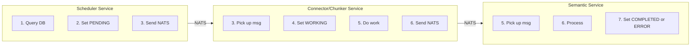
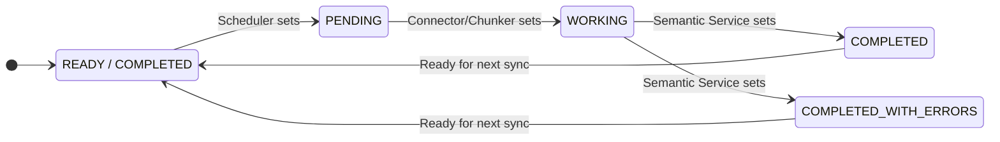
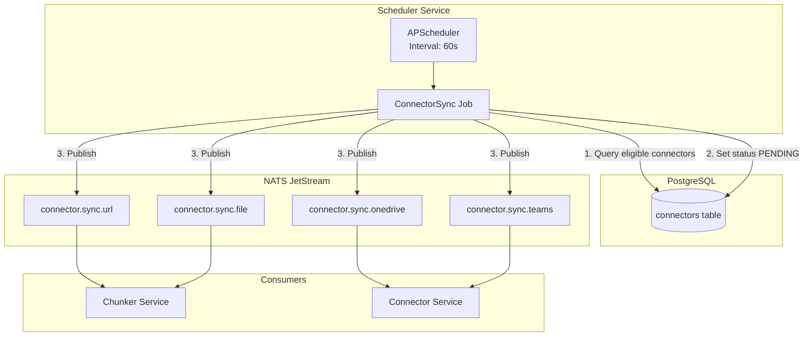
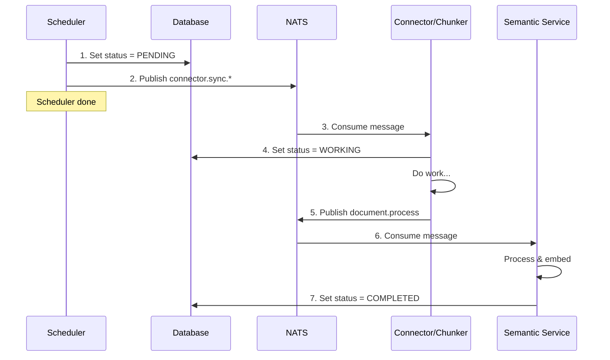

# Scheduler Service Proposal

> **Status**: Draft
> **Technology**: APScheduler
> **Location**: `src/services/scheduler/`

---

## Overview

The Scheduler Service is a **lightweight trigger service** that monitors the database and sends NATS messages when work needs to be done. It does NOT execute any business logic itself.

**What it does:**
- Query the database for connectors due for sync
- Update connector status to `PENDING`
- Publish a message to NATS

**What it does NOT do:**
- Fetch data from external sources
- Process documents
- Update status to `WORKING`, `COMPLETED`, or `ERROR` (other services do this)

---

## Responsibility Boundaries



| Action | Responsible Service |
|--------|---------------------|
| Set status to `PENDING` | Scheduler |
| Set status to `WORKING` | Connector/Chunker Service |
| Set status to `COMPLETED` | Semantic Service |
| Set status to `COMPLETED_WITH_ERRORS` | Semantic Service |
| Set status to `ERROR` / retry | Connector/Semantic Service |

---

## Core Responsibilities

### 1. Connector Sync Check

Query the `connectors` table for rows that need sync:

| Field | Purpose |
|-------|---------|
| `status` | Only trigger if `COMPLETED`, `COMPLETED_WITH_ERRORS`, or `READY_TO_BE_PROCESSED` |
| `refresh_freq_minutes` | Interval between syncs |
| `last_sync_at` | Calculate next run time |
| `type` | Determines routing (Connector vs Chunker) |

### 2. Refresh Rules by Connector Type

| Connector Type | Default Refresh | Route To |
|----------------|-----------------|----------|
| `url` | 7 days | Chunker (direct) |
| `file` | One-time | Chunker (direct) |
| `youtube` | One-time | Chunker (direct) |
| `onedrive` / `gdrive` | 7 days | Connector Service |
| `teams` / `slack` | 1 day | Connector Service |

### 3. Status Flow



**Statuses that BLOCK scheduling:**
- `PENDING` - Already queued
- `WORKING` - Currently processing
- `DISABLED` - User disabled
- `UNABLE_TO_PROCESS` - Permanent failure

---

## Architecture



---

## Job Types

### 1. ConnectorSyncJob (Primary)

Runs every minute, checks for connectors due for sync:

```python
async def connector_sync_check():
    """
    Check for connectors that need synchronization.

    For each connector due for sync:
    1. Update status to PENDING
    2. Publish NATS message

    Does NOT wait for response or do any processing.
    """
    now = datetime.utcnow()

    # Find connectors eligible for sync
    connectors = await db.execute(
        select(Connector)
        .where(Connector.status.in_([
            ConnectorStatus.READY_TO_BE_PROCESSED,
            ConnectorStatus.COMPLETED,
            ConnectorStatus.COMPLETED_WITH_ERRORS,
        ]))
        .where(
            or_(
                Connector.last_sync_at.is_(None),
                Connector.last_sync_at +
                    interval(minutes=Connector.refresh_freq_minutes) <= now
            )
        )
    )

    for connector in connectors:
        # 1. Update status to PENDING
        await db.execute(
            update(Connector)
            .where(Connector.id == connector.id)
            .values(status=ConnectorStatus.PENDING)
        )

        # 2. Publish NATS message (fire-and-forget)
        subject = get_subject_for_type(connector.type)  # e.g., "connector.sync.onedrive"
        await nats.publish(subject, ConnectorSyncRequest(
            connector_id=connector.id,
            connector_type=connector.type,
            config=connector.config,
        ))

        logger.info("📤 Triggered sync for connector %s", connector.id)
```

---

## Integration with Existing Services

### Message Flow (Fire-and-Forget)

The scheduler publishes and moves on. It does NOT wait for responses.



### NATS Subjects

| Subject | Publisher | Consumer | Payload |
|---------|-----------|----------|---------|
| `connector.sync.url` | Scheduler | Chunker | `ConnectorSyncRequest` |
| `connector.sync.file` | Scheduler | Chunker | `ConnectorSyncRequest` |
| `connector.sync.onedrive` | Scheduler | Connector Service | `ConnectorSyncRequest` |
| `connector.sync.gdrive` | Scheduler | Connector Service | `ConnectorSyncRequest` |
| `connector.sync.teams` | Scheduler | Connector Service | `ConnectorSyncRequest` |
| `document.process` | Connector Service | Semantic Service | `DocumentProcessRequest` |

**Note:** The scheduler does NOT subscribe to any subjects. It only publishes.

---

## Database Schema

### Job Store Table (APScheduler)

```sql
-- Created automatically by APScheduler SQLAlchemyJobStore
CREATE TABLE apscheduler_jobs (
    id VARCHAR(191) PRIMARY KEY,
    next_run_time FLOAT,
    job_state BYTEA NOT NULL
);

CREATE INDEX ix_apscheduler_jobs_next_run_time
    ON apscheduler_jobs (next_run_time);
```

### Scheduler Audit Table (Custom)

```sql
CREATE TABLE scheduler_runs (
    id UUID PRIMARY KEY DEFAULT gen_random_uuid(),
    job_name VARCHAR(100) NOT NULL,
    connector_id UUID REFERENCES connectors(id),
    started_at TIMESTAMP NOT NULL DEFAULT NOW(),
    completed_at TIMESTAMP,
    status VARCHAR(20) NOT NULL, -- 'running', 'completed', 'failed'
    error_message TEXT,
    documents_processed INT DEFAULT 0
);

CREATE INDEX idx_scheduler_runs_connector
    ON scheduler_runs (connector_id, started_at DESC);
```

---

## Configuration

### Environment Variables

```bash
# Scheduler Settings
SCHEDULER_ENABLED=true
SCHEDULER_CHECK_INTERVAL_SECONDS=60
SCHEDULER_MAX_CONCURRENT_SYNCS=5
SCHEDULER_JOB_STORE_URL=${DATABASE_URL}

# Default Refresh Intervals (minutes)
SCHEDULER_DEFAULT_REFRESH_WEB=10080       # 7 days
SCHEDULER_DEFAULT_REFRESH_DRIVE=10080     # 7 days
SCHEDULER_DEFAULT_REFRESH_CHAT=1440       # 1 day
SCHEDULER_DEFAULT_REFRESH_FILE=0          # Never (one-time)
```

---

## Service Structure

```
src/services/scheduler/
├── __init__.py
├── main.py                 # Entry point
├── logic/
│   ├── __init__.py
│   ├── scheduler_service.py    # Core scheduling logic
│   ├── jobs/
│   │   ├── __init__.py
│   │   ├── connector_sync.py   # Connector sync job
│   │   ├── cleanup.py          # Cleanup job
│   │   └── health_check.py     # Health check job
│   └── exceptions.py           # Domain exceptions
├── middleware/
│   └── error_handler.py
└── config.py               # Service configuration
```

---

## Implementation Phases

### Phase 1: Core Scheduler (MVP)
- [ ] APScheduler setup with PostgreSQL job store
- [ ] Connector sync check job (every minute)
- [ ] Update connector status to PENDING
- [ ] NATS publisher for sync triggers
- [ ] Basic health endpoint (`/healthz`)
- [ ] Docker Compose integration

### Phase 2: Production Ready
- [ ] Metrics export (Prometheus)
- [ ] Leader election for K8s (only one scheduler runs)
- [ ] Helm chart
- [ ] ConfigMap/Secret integration

---

## High Availability

### Single Instance (Docker Compose)
- Simple: one scheduler container
- Job store in PostgreSQL ensures jobs persist across restarts

### Multiple Instances (Kubernetes)
- **Leader Election**: Use PostgreSQL advisory locks or Kubernetes Lease API
- Only the leader executes jobs
- Followers remain on standby for failover

```python
# Leader election with PostgreSQL advisory lock
async def acquire_leadership():
    result = await db.execute(
        text("SELECT pg_try_advisory_lock(12345)")
    )
    return result.scalar()
```

---

## Observability

### Logging (Emoji Convention)

```python
logger.info("🕐 Scheduler started")
logger.info("🔍 Checking connectors for sync...")
logger.info("📤 Triggered sync for connector %s", connector_id)
logger.info("✅ Sync completed for connector %s", connector_id)
logger.error("❌ Sync failed for connector %s: %s", connector_id, error)
logger.warning("⏭️ Skipping connector %s (already syncing)", connector_id)
```

### Metrics

| Metric | Type | Description |
|--------|------|-------------|
| `scheduler_jobs_total` | Counter | Total jobs executed |
| `scheduler_jobs_failed` | Counter | Failed job executions |
| `scheduler_sync_duration_seconds` | Histogram | Sync job duration |
| `scheduler_pending_syncs` | Gauge | Connectors waiting for sync |

---

## Dependencies

```toml
# pyproject.toml additions
[project.dependencies]
apscheduler = "^3.10"
sqlalchemy = "^2.0"  # Already in echomind_lib
nats-py = "^2.0"     # Already in echomind_lib
```

---

## Open Questions

1. **How to handle stuck connectors?**
   - If a connector stays in `PENDING` or `WORKING` for too long, should the scheduler reset it?
   - Or should another service (health monitor) handle this?

2. **Manual trigger via API?**
   - Should the main API have an endpoint to manually trigger a sync?
   - This would bypass the scheduler and directly publish to NATS

---

## References

- [APScheduler Documentation](https://apscheduler.readthedocs.io/)
- [EchoMind Architecture](./architecture.md)
- [Cognix Orchestrator Pattern](../sample/docs/golang/orchestrator.md)